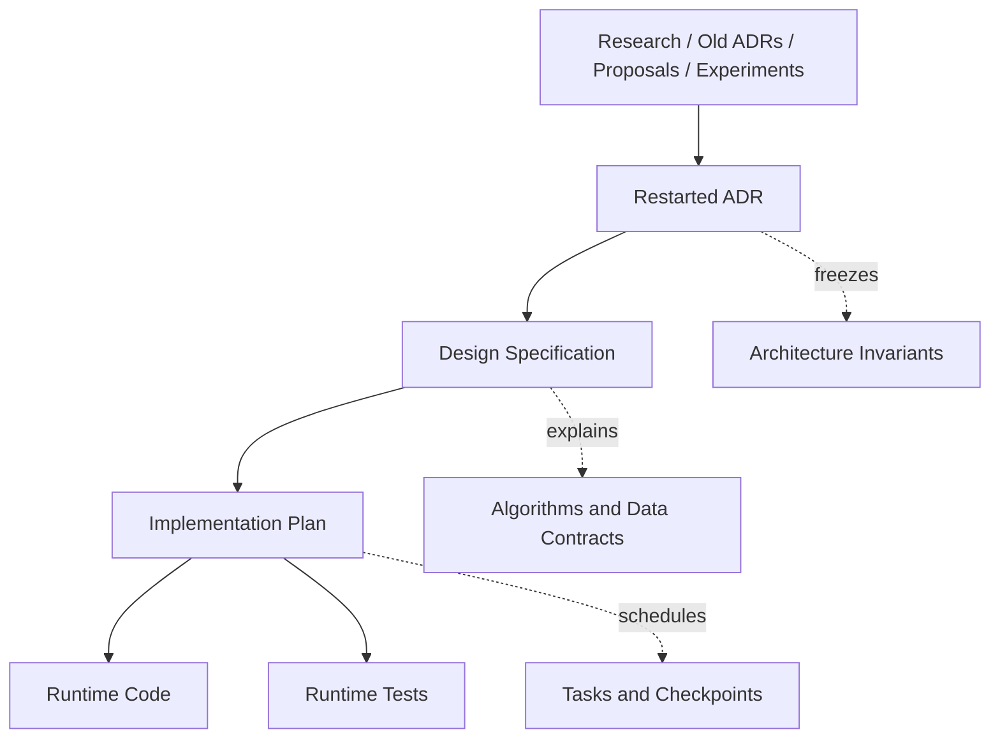

# ADR-000 — Architecture Record Policy and Documentation Vocabulary

## Status

Accepted.

## Date

2026-05-16

## Context

Atlas is being restarted from a clean architectural baseline. Earlier ADRs, notes, experiments, source files, and external proposals remain useful as research material, but they are no longer automatically authoritative.

The project needs a documentation system that separates frozen architectural decisions from evolving algorithm specifications and implementation task plans. Without this separation, ADRs become too large, too detailed, and too fragile. They start mixing permanent architecture, temporary implementation steps, pseudocode, test plans, and speculative algorithms.

This ADR defines the documentation policy for the restarted Atlas architecture.

## Decision

Atlas documentation will use three primary document types:

```text
ADR
  Freezes architectural decisions, invariants, boundaries, and rejected alternatives.

Design Specification
  Describes detailed systems, algorithms, field contracts, job graphs, buffers, tests, and implementation constraints.

Implementation Plan
  Defines work order, file tasks, migration steps, test checkpoints, and delivery sequence.
````

ADRs are the only documents that freeze architectural decisions.

Design specifications may evolve as implementation knowledge improves.

Implementation plans are disposable execution documents and should not be treated as architecture.

Old ADRs and old design documents are reference material only until a restarted ADR explicitly accepts a decision.

## Documentation Hierarchy



## Document Type Rules

### ADR

An ADR must answer:

```text
What decision is being made?
Why is this decision being made?
Which alternatives were rejected?
What invariants must not be violated?
What are the consequences?
```

An ADR should be short enough to review and stable enough to keep.

An ADR must not become a full implementation manual.

ADRs may include diagrams when the diagram clarifies a decision boundary, ownership model, or lifecycle.

ADRs should not include large pseudocode blocks unless the pseudocode is itself the architectural contract.

### Design Specification

A design specification describes how a system works in detail.

A design specification may include:

```text
field lists
operation graphs
route definitions
job graphs
buffer layouts
scheduler behavior
algorithm pseudocode
failure policy
test matrix
performance constraints
Burst/DOTS constraints
```

A design specification can change without invalidating an ADR, as long as the ADR invariants remain true.

### Implementation Plan

An implementation plan defines work order.

An implementation plan may include:

```text
files to create
files to modify
test files to add
migration steps
compile gates
test gates
known risks
checkpoint criteria
```

Implementation plans must not define permanent architecture.

## Authority Rules

The following authority order applies:

```text
1. Accepted restarted ADRs
2. Current source code and passing tests
3. Current design specifications
4. Current implementation plans
5. Old ADRs, old notes, proposals, and experiments
```

Old documents may inspire new decisions, but they are not binding.

If an old ADR conflicts with an accepted restarted ADR, the restarted ADR wins.

If a design specification conflicts with an accepted ADR, the ADR wins.

If source code conflicts with an accepted ADR, the code is either wrong or the ADR must be explicitly superseded.

## ADR Status Values

Atlas ADRs may use these statuses:

```text
Proposed
Accepted
Superseded
Rejected
Deprecated
```

### Proposed

The decision is being reviewed and is not yet binding.

### Accepted

The decision is binding for future implementation.

### Superseded

A later ADR replaced this decision.

A superseded ADR must link to the replacing ADR.

### Rejected

The decision was considered and explicitly rejected.

Rejected ADRs may be kept when the reasoning is valuable.

### Deprecated

The decision is still historical context but should no longer guide new implementation.

## Numbering Policy

Restarted ADRs use a new sequence:

```text
ADR-000
ADR-001
ADR-002
...
```

Old ADR numbers are not reused as authority.

If an old topic is rewritten, the restarted ADR receives a new number.

Example:

```text
Old ADR:
  ADR-006 Production Landmass Algorithm Contract

Restarted ADR:
  ADR-005 Landmass Stage Contract
```

The restarted number is the authoritative one.

## Naming Policy

ADR filenames use this format:

```text
ADR-000 Short Title.md
```

Design specifications use this format:

```text
Design/Short System Name Specification.md
```

Implementation plans use this format:

```text
Plans/Short Plan Name.md
```

The title should describe the decision or system, not the implementation task.

Good:

```text
ADR-002 Field Lifetime Workspace Transient Scratch Artifact Policy.md
Design/Landmass Primary Continent Route Specification.md
Plans/Landmass Stage Implementation Plan.md
```

Bad:

```text
ADR-002 Add Some Buffers.md
ADR-003 Implement Jobs.md
Plan/Fix Stuff.md
```

## Language Policy

Atlas documentation should use precise production language.

Use:

```text
must
must not
should
should not
may
```

Meanings:

```text
must
  Required architectural rule.

must not
  Forbidden by architecture.

should
  Strong default; exceptions require justification.

should not
  Strong avoidance; exceptions require justification.

may
  Allowed but not required.
```

Avoid vague language such as:

```text
probably
maybe
for now
temporary
simple version
minimal version
good enough
```

If a decision is intentionally incomplete, describe the missing contract directly.

Example:

```text
External storage is valid vocabulary, but executable workspace use is rejected until an explicit external binding contract exists.
```

## Diagrams

Mermaid diagrams are allowed when they clarify:

```text
ownership
lifecycle
data flow
stage/operation/job hierarchy
artifact boundaries
scheduler control flow
```

Diagrams must not replace written invariants.

A diagram is explanatory; the text is authoritative.

## Source and Test References

ADRs may reference source paths only when the path is part of the decision.

Design specifications and implementation plans should reference source paths more freely.

When referencing source paths, use package-relative paths:

```text
Runtime/...
Tests/Runtime/...
Documentation/...
```

Do not reference local machine paths.

## Change Policy

Changing an accepted ADR requires one of:

```text
a new ADR that supersedes it
a status change to Deprecated or Superseded
a narrow correction that does not change the decision
```

Small editorial fixes do not require a new ADR.

Changing an invariant, rejected alternative, ownership rule, or lifecycle rule requires a new ADR.

## Consequences

This policy keeps architectural decisions reviewable and durable.

It prevents algorithm specifications from becoming frozen too early.

It allows complex systems such as Landmass generation, transient field lifetimes, schedulers, and job graphs to be documented in detail without overloading ADRs.

It makes the restarted ADR set the authoritative architecture baseline for Atlas.

```