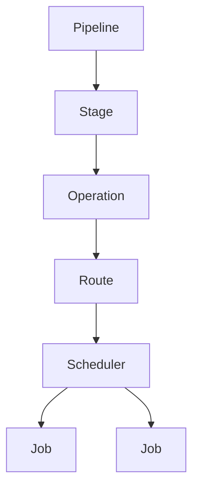

# ADR-001 — Stage, Operation, Route, Scheduler, and Job

## Status

Accepted.

## Date

2026-05-16

## Context

Atlas generation needs stable vocabulary for different architectural levels. Without precise boundaries, stages become operations, operations become jobs, jobs decide algorithm control flow, and temporary buffers become canonical fields.

## Decision

Atlas uses five distinct concepts:

```text
Stage
Operation
Route
Scheduler
Job
```



## Definitions

A stage is a semantic generation phase. Good stage names are broad semantic nouns such as Landmass, Hydrology, Climate, and Surface.

An operation is a deterministic transform with a stable input/output contract. It owns the semantic result. It may schedule one job, many jobs, or a repeated job sub-chain.

A route is a selected algorithm family for satisfying the same stage or operation contract. A route is not a stage, operation, or job.

A scheduler owns execution control flow for one operation's job graph: job order, repeats, dependencies, scratch lifetime, termination, and failure policy.

A job is one Burst-executable data transform over known native data.

## Required Boundary

```text
Operation
  owns the invariant/result

Scheduler
  owns the algorithm control flow

Job
  owns one data transform
```

## Repeated Job Chains

Repeated job chains are allowed, but repetition belongs to the scheduler. Production generation must not contain hidden unbounded run-until-stable loops.

## Naming Rules

Stage names should be broad semantic nouns. Operation names should describe the durable or stage-transient result. Route names should describe the algorithm family. Scheduler names should name the operation or route they schedule. Job names should describe one concrete transformation.

Avoid meaningless prefixes such as `Generate` when the package context already implies generation.

## Invariants

```text
A stage is a semantic generation phase.
An operation owns a stable result contract.
A route is an algorithm family, not pipeline identity.
A scheduler owns job order, repeated chains, dependencies, and scratch lifetime.
A job owns one deterministic data transform.
Jobs do not resolve fields.
Jobs do not decide operation repeat counts.
Operation identity must not change when the internal job graph changes.
```
