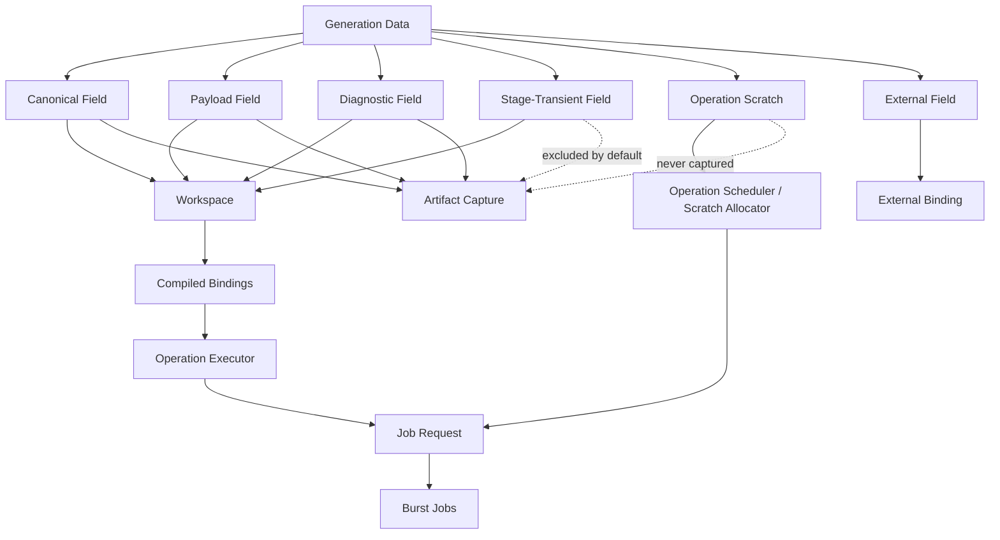
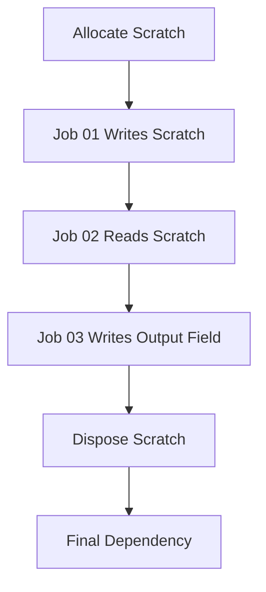

# ADR-002 — Field Lifetime, Workspace, Transient, Scratch, and Artifact Policy

## Status

Accepted.

## Date

2026-05-16

## Context

Atlas generation requires multiple categories of data.

Some data is durable map truth and must be visible to later stages. Some data is renderer, physics, navigation, or artifact payload. Some data exists only to support diagnostics. Some data is produced by one operation and consumed by another operation inside the same stage. Some data is private to jobs inside one operation.

Without a precise lifetime model, implementation details can pollute the canonical map layer. Temporary algorithm buffers can become fake fields. Debug data can accidentally become artifact truth. Job-local scratch can be forced into workspace contracts just so multiple jobs can communicate.

The package needs a strict data-lifetime policy that supports production algorithms without corrupting the map ABI.

## Decision

Atlas will distinguish these data categories:

```text
Canonical field
Payload field
Diagnostic field
Stage-transient field
Operation scratch
External field
````

The core rule is:

```text
If another stage consumes it, it is canonical, payload, or diagnostic data.
If another operation in the same stage consumes it, it is stage-transient workspace data.
If only jobs inside one operation consume it, it is operation scratch.
If storage is owned outside Atlas, it is external and requires an explicit binding contract.
```

This distinction is mandatory.

Operation-local implementation details must not be promoted to canonical fields just to pass data between jobs.

Stage-level intermediate results must not be hidden in operation scratch if later operations consume them.

Artifact capture must not include transient or scratch data by default.

## Data Lifetime Model



## Canonical Fields

A canonical field is durable map truth.

Canonical fields define the authoritative generated world state. They may be consumed by later stages, captured into artifacts, hashed as part of deterministic output, and used by downstream systems.

Examples:

```text
field.land.mask
field.ocean.mask
field.land.label
field.base.elevation
field.hydro.elevation
field.biome.id
field.surface.index
```

Canonical fields must have:

```text
stable identity
declared storage format
declared shape domain
declared lifetime
declared ownership
declared hash policy
explicit operation ownership
```

A canonical field must not exist only because one algorithm needed a temporary buffer.

## Payload Fields

A payload field is derived output for a specific downstream consumer.

Payload fields may support:

```text
presentation
physics
navigation
serialization
runtime query systems
```

Payload fields are not allowed to redefine canonical world truth.

Examples:

```text
presentation material index
presentation blend weights
physics traversal payload
navigation walkability payload
```

Payload fields may be captured into artifacts when the selected artifact profile includes them.

Payload fields must state which canonical fields they derive from.

## Diagnostic Fields

A diagnostic field supports validation, metrics, debug output, or tooling.

Examples:

```text
world validation score
reject reason
coverage metric
debug class
intermediate quality metric
```

Diagnostic fields are explicit. They must not be hidden side effects.

Diagnostic fields may be captured by diagnostic artifact profiles. They are excluded from canonical artifact hashes unless explicitly declared as participating.

Diagnostic data must not become gameplay or terrain truth unless promoted by a separate accepted decision.

## Stage-Transient Fields

A stage-transient field is workspace data produced by one operation and consumed by another operation inside the same stage.

Stage-transient fields are real fields from the compiler and workspace perspective:

```text
they have stable or stage-scoped identity
they have storage format
they have shape domain
they have lifetime
they are allocated by the workspace
they are resolved into compiled bindings
```

However, they are not canonical map truth.

They are excluded from artifact capture by default.

Examples inside the `Landmass` stage:

```text
transient.continent.suitability
transient.continent.suitability_cutoff
transient.continent.candidate_mask
transient.continent.primary_mask
transient.continent.area
transient.continent.growth_cutoff
```

Stage-transient fields are required when operation boundaries need to communicate intermediate data.

Example:

```text
EvaluateContinentSuitability
  writes transient.continent.suitability

FormContinentCandidate
  reads transient.continent.suitability
  writes transient.continent.candidate_mask
```

This data cannot be operation scratch because another operation consumes it.

## Operation Scratch

Operation scratch is temporary native memory used only inside one operation's scheduler/job graph.

Operation scratch is not a field.

Operation scratch must not have a stable field identity.

Operation scratch must not be captured into artifacts.

Operation scratch must not be visible to later operations.

Examples:

```text
block histograms
component parent arrays
component link buffers
partial reduction buffers
flood-fill queues
temporary score arrays
prefix-sum work buffers
distance transform ping-pong buffers
erosion simulation scratch
```

Operation scratch is owned by one of:

```text
operation scheduler
operation scratch allocator
operation executor through a scheduler request
```

Scratch disposal must be dependency-aware.

The final dependency returned by the scheduler must include:

```text
all jobs that read/write scratch
all scheduled scratch disposal work
```

The required invariant is:

```text
Scratch memory lives until the last job that can touch it has completed.
```

## External Fields

An external field is storage owned outside the Atlas workspace.

External storage is valid vocabulary, but executable use requires an explicit external binding model.

Until such a model exists, external fields must be rejected from executable workspace paths.

An external binding model must define:

```text
owner
lifetime
read/write access
job-safety contract
artifact-capture policy
disposal responsibility
dependency ownership
```

External fields must not silently behave like Atlas-owned fields.

## Field Category Ownership

```text
Category          Allocated By             Visible To Operations     Captured By Default
----------------  -----------------------  ------------------------  -------------------
Canonical         Atlas workspace          Yes                       Yes
Payload           Atlas workspace          Yes                       Profile-dependent
Diagnostic        Atlas workspace          Yes                       Profile-dependent
Stage-transient   Atlas workspace          Same stage operations     No
Operation scratch Scheduler / scratch API  Jobs in one operation     Never
External          External owner           Bound operations only     Policy-dependent
```

## Workspace Policy

The workspace owns Atlas-allocated field memory for:

```text
canonical fields
payload fields
diagnostic fields
stage-transient fields
```

The workspace does not own:

```text
operation scratch
external storage
managed artifact payload copies
debug image output
```

Workspace allocation must be based on resolved field shapes and storage support policy.

Unsupported storage kinds must be rejected before allocation.

External storage must be rejected unless an explicit external binding contract exists.

## Artifact Policy

Artifact capture must preserve durable output without leaking algorithm internals.

Default artifact capture includes:

```text
canonical fields
```

Artifact profiles may include:

```text
payload fields
diagnostic fields
```

Default artifact capture excludes:

```text
stage-transient fields
operation scratch
external fields without explicit capture policy
```

Stage-transient debug capture may exist later, but it must be explicit and must not affect canonical artifact hashes.

Operation scratch is never captured.

## Hash Policy

Canonical fields may participate in stable artifact/content hashes.

Payload and diagnostic fields participate only when their field contracts say so.

Stage-transient fields do not participate in canonical output hashes by default.

Operation scratch never participates in hashes.

This prevents temporary algorithm implementation details from changing durable map identity.

## Operation Boundary Rules

An operation executor may resolve compiled field bindings for:

```text
canonical fields
payload fields
diagnostic fields
stage-transient fields
```

An operation executor may allocate or request operation scratch for private job communication.

An operation executor must not create new canonical fields at runtime.

An operation executor must not expose operation scratch as a field.

A job must receive typed native data from the executor or scheduler. It must not resolve field identity.

## Stage-Transient Lifetime

A stage-transient field lives for the duration required by its stage.

At minimum, it must live from the producing operation through the final consuming operation.

The compiler or stage schema should be able to determine:

```text
producer operation
consumer operation or operations
first use
last use
storage format
shape
artifact exclusion
```

Future workspace optimization may reuse stage-transient memory after the last consumer.

Memory reuse must not change observable behavior.

## Scratch Lifetime

Operation scratch lives only inside one operation execution.

The scheduler owns scratch lifetime.

Scratch disposal must be chained to the scheduler's final dependency.

Example:



The operation executor returns the final dependency after scratch disposal has been scheduled.

## Debug Policy

Debug systems may visualize:

```text
canonical fields
payload fields
diagnostic fields
explicitly requested stage-transient fields
```

Debug systems must not require operation scratch to be preserved after operation execution.

If a scratch value needs debug visualization, it should be promoted intentionally to a diagnostic or stage-transient field.

## Compiler Responsibilities

The compiler and validators must enforce:

```text
stage-transient fields are not consumed outside their allowed scope
operation scratch is not declared as a field
external fields are not executable without binding policy
unsupported storage is rejected before allocation
artifact profiles do not capture excluded lifetimes by default
```

The compiler should report lifetime/visibility violations deterministically.

## Consequences

### Positive

This policy prevents canonical field pollution.

It supports complex multi-job operations without forcing private buffers into the field catalog.

It allows operations inside a stage to share intermediate data safely.

It keeps artifact output stable and meaningful.

It creates a clear path for future memory reuse of stage-transient data.

It makes external storage explicitly unsafe until a binding contract exists.

### Negative

The package needs explicit lifetime metadata.

Stage-transient fields require compiler/workspace support.

Operation scratch requires dependency-aware disposal.

Debugging scratch data requires deliberate promotion to a visible field.

Some algorithms require more design up front to decide whether data is stage-transient or scratch.

## Rejected Alternatives

### Rejected: Everything is a canonical field

This pollutes the map ABI with algorithm internals and makes artifacts unstable.

### Rejected: All intermediates are job-local scratch

This fails when one operation consumes data produced by a previous operation.

### Rejected: Stage-transient fields captured by default

This leaks implementation detail into artifacts and hashes.

### Rejected: External fields behave like Atlas-owned fields

This hides ownership, lifetime, job-safety, and capture-policy problems.

### Rejected: Jobs allocate shared scratch directly without scheduler ownership

This makes scratch disposal and dependency safety fragile.

## Invariants

Atlas implementation must preserve these invariants:

```text
Canonical fields are durable map truth.
Payload fields are derived consumer data.
Diagnostic fields are explicit tooling/validation data.
Stage-transient fields are workspace data shared by operations inside one stage.
Operation scratch is private to one operation's job graph.
External fields require explicit binding before executable use.
Operation scratch is never captured into artifacts.
Stage-transient fields are excluded from artifact capture by default.
Jobs do not resolve field identity.
Scratch disposal is chained through JobHandle dependencies.
```

```