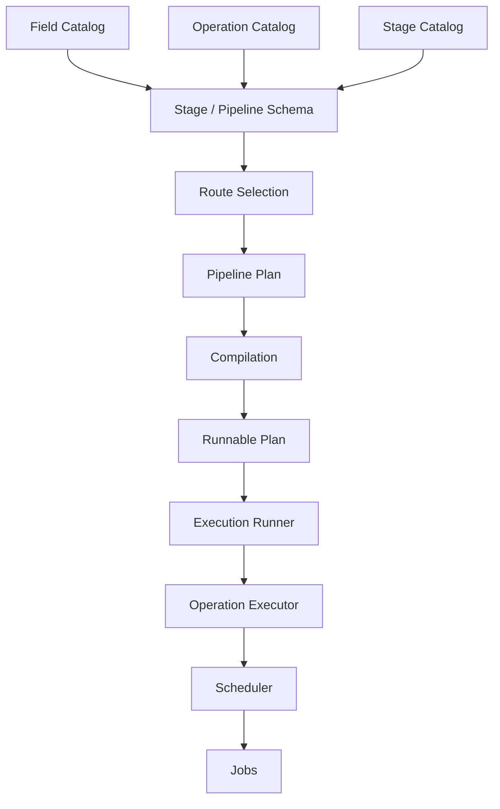
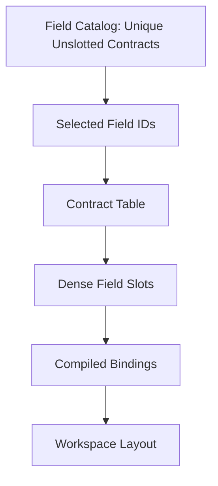
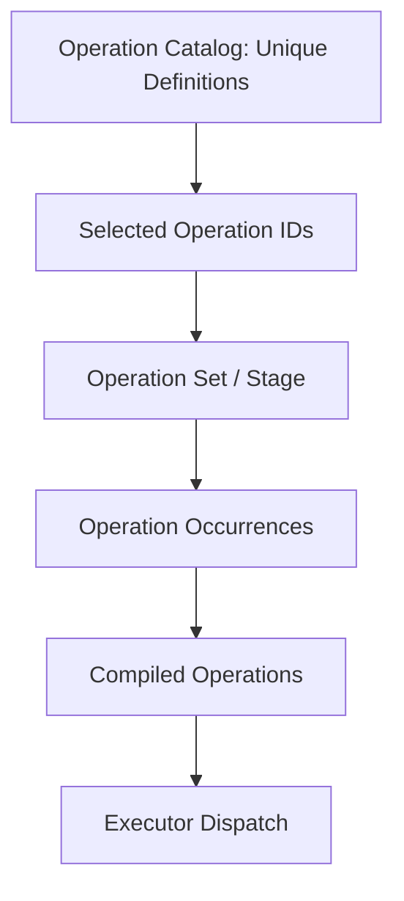
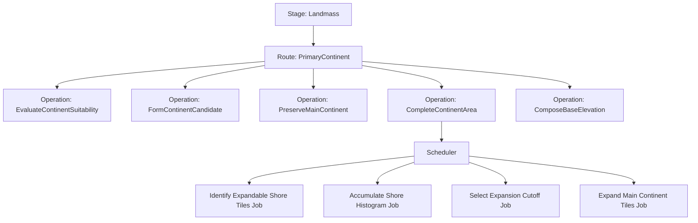

# ADR-004 — Catalog, Schema, and Runnable Plan Contract

## Status

Accepted.

## Date

2026-05-16

## Context

Atlas generation is compiled and validated before execution. Runtime jobs must not discover generation structure dynamically. They must receive resolved native data and deterministic parameters.

The package needs a clear boundary between:

```text
what exists
what a pipeline requires
what this run selected
what can execute
what a Burst job receives
````

Without this boundary, algorithm routes can leak into durable operation identity, declared-only operations can enter executable plans, jobs can become catalog concepts, and stable pipeline schemas can become coupled to temporary implementation details.

Atlas also needs to support multiple routes for a stage or operation. A route may change the internal operation sequence or job graph, but it must still satisfy the same declared stage-level output contract.

This ADR defines the catalog, schema, compilation, and runnable plan model.

## Decision

Atlas will distinguish these concepts:

```text
Catalog
Schema
Route
Plan
Runnable plan
Executor registry
Job graph
```

The core rule is:

```text id="iqaf39"
Catalogs define what exists.
Schemas define what is required.
Routes choose how requirements are satisfied.
Plans define what this run selected.
Runnable plans contain only executable operations.
Jobs are never catalog identities.
```

## Concept Model



## Catalog

A catalog defines durable identities and metadata.

Catalogs answer:

```text id="lxkl0v"
What fields exist?
What operations exist?
What stages exist?
What routes exist?
What ABI identities are stable?
```

Catalogs do not describe one run. They describe the available vocabulary.

### Field Catalog

A field catalog defines field identities and field contracts.

It owns:

```text id="ac7503"
stable field identity
field debug name
semantic role
storage format
ownership policy
lifetime policy
shape domain
length shape
hash participation
```

The field catalog does not assign table slots for one run.

Slot assignment belongs to a run-specific contract table.

### Operation Catalog

An operation catalog defines durable operation identities and operation contracts.

It owns:

```text id="msqr3p"
stable operation identity
operation debug name
operation role
declared read/write access contracts
implementation state
route compatibility where applicable
```

The operation catalog does not decide how many times an operation appears in one stage or pipeline.

Operation occurrence belongs to a plan.

### Stage Catalog

A stage catalog defines durable stage identities and stage-level contracts.

It owns:

```text id="olpaet"
stable stage identity
stage debug name
stage role
required outputs
allowed routes
stage ordering policy
```

A stage catalog must not be polluted with route-specific names when the semantic stage remains stable.

Good:

```text
Landmass
Hydrology
Climate
Surface
```

Bad:

```text
ShapePrimaryContinent
RunSimplexFbm
```

## Schema

A schema defines required structure.

Schemas answer:

```text id="y3j5p5"
Which stages are required?
Which operation kinds are required inside a stage?
Which outputs must exist after a stage?
Which routes are allowed?
Which operation order constraints apply?
```

Schemas are not execution output. They are validation contracts.

A schema can be fulfilled by different routes when those routes produce the same required outputs and satisfy the same downstream invariants.

## Route

A route is an algorithm family selected to satisfy a schema or operation contract.

Routes answer:

```text id="fzpobc"
Which implementation strategy should satisfy this requirement?
```

Examples:

```text
Landmass route:
  PrimaryContinent
  Archipelago
  IslandWorld
  InlandSea

ComposeBaseElevation route:
  TopologyConstrainedFbm
  ImportedHeightmap
  ContinentalProfile
```

A route must not become a durable operation identity unless it produces a different operation-level result contract.

For example:

```text id="cot1cf"
Operation:
  ComposeBaseElevation

Routes:
  TopologyConstrainedFbm
  ImportedHeightmap
```

Both routes satisfy the same operation contract:

```text id="arj0q5"
produce field.base.elevation
```

They are not separate pipeline operations unless their inputs, outputs, or invariants differ materially.

## Plan

A plan describes what a specific generation run selected.

A plan answers:

```text id="q4hafp"
Which stages run?
Which operations occur?
Which route was selected?
Which contract table is used?
Which fields are included?
Which parameters are bound?
```

A plan may contain operation occurrences.

An operation may appear multiple times in a plan if the schema allows repeated occurrences.

Repeated occurrence is not the same as duplicate operation definition.

```text id="jfhzxp"
Operation catalog:
  one unique definition

Operation set / plan:
  zero, one, or many occurrences
```

## Runnable Plan

A runnable plan is a compiled plan that can execute.

A runnable plan must satisfy:

```text id="kjob43"
all required fields are present
all required operation definitions are present
all selected operations are executable
all compiled bindings are resolved
all shape requirements are resolved
all storage requirements are supported
all dataflow requirements are valid
all write hazard policies are valid
all required executors are registered
```

Declared-only operations must not enter executable plans.

They may exist in catalogs and schemas, but the compiler or workflow must reject them before execution.

## Implementation State

Operation definitions should declare implementation state.

Examples:

```text id="mnamml"
Declared
Executable
Deprecated
Disabled
Experimental
```

The runnable workflow accepts only operations that are executable under the selected policy.

Declared-only operations are useful for future ABI planning, but they are not runnable.

## Compilation Boundary

Compilation transforms authoring/catalog/schema metadata into executable metadata.

Compilation owns:

```text id="g4org8"
stage occurrence validation
operation occurrence validation
field contract table validation
binding resolution
shape resolution
dataflow validation
write hazard validation
storage support validation
runnable plan creation
```

Compilation must not schedule jobs.

Compilation must not allocate workspace memory except for compiler-owned temporary managed/native structures.

Compilation must not run generation algorithms.

## Runtime Execution Boundary

Runtime execution consumes a runnable plan.

Execution owns:

```text id="c704ez"
workspace allocation
execution context creation
operation executor lookup
operation scheduling
dependency chaining
workspace/result ownership
artifact capture after completion
debug export after completion
```

Execution must not mutate catalog definitions.

Execution must not allow jobs to resolve fields by stable IDs.

## Job Boundary

Jobs are private implementation details of operation routes and schedulers.

Jobs are not catalog identities.

Jobs must not appear in pipeline schemas.

Jobs must not be selected directly by user-facing pipeline configuration.

A route or scheduler may change its internal job graph without changing the operation identity, as long as the operation contract remains satisfied.

This allows:

```text id="sjv096"
one-job first implementation
multi-job optimized implementation
block-based implementation
parallel reduction implementation
different scratch-buffer strategy
```

without breaking pipeline identity.

## Field Slot and Contract Table Policy

The field catalog owns durable field definitions.

A contract table owns the selected field set for one compiled run.

The contract table assigns dense slots.

The field catalog must not preserve stale table-local slots.



Slot zero is valid.

Slot assignment must be represented explicitly by table membership and assigned-slot metadata, not by invalid sentinel values.

## Operation Catalog and Operation Set Policy

The operation catalog owns unique operation definitions.

An operation set or compiled stage owns ordered operation occurrences.



Duplicate operation definitions are invalid.

Repeated operation occurrences may be valid when the stage schema allows them.

## Executor Registry Policy

Executors bind runnable operation identities to managed execution implementations.

The executor registry answers:

```text id="e8f1j3"
Which executor handles this operation id?
```

The executor registry must not invent operation identities.

Operation identity comes from the operation catalog.

The default executor registry may infer built-in executors only when the operation contract exactly matches the executor's supported contract.

Executor inference must be conservative.

If no executor is registered for a runnable operation, execution fails before silently skipping the operation.

## Route Compatibility Policy

A route must declare or prove the outputs it satisfies.

For a stage route:

```text id="bkomuk"
route must produce all required stage outputs
route must respect stage data lifetime policy
route must use only allowed operation sequence or compatible operation schema
```

For an operation route:

```text id="tg6592"
route must satisfy the operation's read/write contract
route must produce the required output fields
route must obey deterministic and storage policies
```

A route that cannot satisfy required outputs must be rejected at compile time.

## Diagnostics Policy

Compiler and workflow diagnostics must identify the boundary that failed.

Examples:

```text id="yqz77h"
unknown field id
duplicate operation definition
declared-only operation selected for runnable plan
route does not produce required stage output
missing executor
unsupported storage kind
read before write
write coverage violation
external storage binding missing
```

Diagnostics should report:

```text id="sd7r3p"
stage
operation
binding
field
route
policy
```

when available.

## Example: Landmass Stage

The `Landmass` stage has a stable semantic responsibility:

```text id="e90wif"
produce initial macro land/ocean topology and base elevation
```

The `PrimaryContinent` route may satisfy this through:

```text id="x8o2hu"
EvaluateContinentSuitability
FormContinentCandidate
PreserveMainContinent
CompleteContinentArea
ComposeBaseElevation
```

The route is not the stage.

The operations are not jobs.

The jobs are private scheduler details.



## Testing Requirements

Catalog and compilation tests must verify:

```text id="c8k0hs"
unique field definitions
unique operation definitions
duplicate debug-name rejection
contract table slot assignment
operation occurrence ordering
declared-only operation rejection
route output compatibility
missing field diagnostics
missing executor diagnostics
unsupported storage diagnostics
dataflow diagnostics
write hazard diagnostics
```

Runnable workflow tests must verify:

```text id="m4v0h8"
runnable plan executes when all contracts are satisfied
declared-only operations cannot execute
missing executor fails deterministically
artifact capture occurs only after completed execution
debug export occurs only after artifact capture
```

## Consequences

### Positive

This decision keeps durable identity separate from per-run selection.

It prevents jobs from entering pipeline/catalog identity.

It allows routes to change internal job graphs without breaking operation contracts.

It makes declared future operations safe to keep in catalogs without pretending they are executable.

It gives compilation a clear responsibility boundary.

It gives execution a clear responsibility boundary.

### Negative

The package must maintain explicit catalogs, schemas, plans, and executable registries.

Route compatibility needs validation.

Declared-only operations require careful diagnostics so users understand why a plan is not runnable.

Pipeline construction requires more metadata than directly scheduling jobs.

## Rejected Alternatives

### Rejected: Jobs are cataloged operations

Jobs are implementation details. Cataloging jobs would make private scheduling choices part of the public ABI.

### Rejected: Route is encoded as operation identity by default

Routes are algorithm strategies. Operation identity should change only when the operation contract changes.

### Rejected: Declared-only operations execute as no-ops

This hides missing implementation and corrupts output trust.

### Rejected: Field catalog owns run slots

Slots are run-specific contract table metadata. Catalogs own durable definitions, not one run's layout.

### Rejected: Executor registry invents operation IDs

Operation identity belongs to the operation catalog.

## Invariants

Atlas implementation must preserve these invariants:

```text id="e6f8gw"
Catalogs define what exists.
Schemas define what is required.
Routes choose how requirements are satisfied.
Plans define what this run selected.
Runnable plans contain only executable operations.
Declared-only operations do not execute.
Jobs are never catalog identities.
Field catalogs do not own run slots.
Operation catalogs do not own operation occurrences.
Executor registries do not invent operation identities.
Compilation validates structure and contracts.
Execution schedules operations and jobs.
```

```