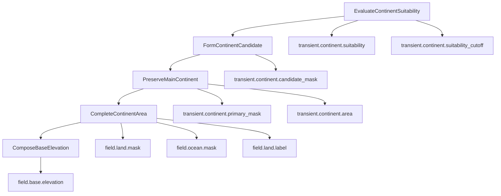

# ADR-005 — Landmass Stage Contract

## Status

Accepted.

## Date

2026-05-16

## Context

Atlas needs a production-grade first generation stage that creates the initial large-scale world shape.

A raw noise-first base elevation field is not sufficient as the first landmass authority. Thresholding a noise heightfield can produce fragmented land, uncontrolled land coverage, accidental islands, unstable coast structure, and poor downstream hydrology/coastline inputs.

Atlas needs explicit topology control before composing base elevation.

The Landmass stage must therefore establish:

```text
primary land/ocean topology
primary continent identity
initial full-map base elevation
````

Base elevation is still required, but it should be composed after accepted topology exists. Noise and FBM may contribute detail and variation, but they must not be the first authority for land/ocean topology.

## Decision

Atlas will define one stage:

```text
Stage: Landmass
```

The `Landmass` stage owns initial macro map structure.

For the first accepted route, the stage uses:

```text
Route: PrimaryContinent
```

The `PrimaryContinent` route contains these operations:

```text
Operation 01: EvaluateContinentSuitability
Operation 02: FormContinentCandidate
Operation 03: PreserveMainContinent
Operation 04: CompleteContinentArea
Operation 05: ComposeBaseElevation
```

The first four operations own topology correctness.

The fifth operation owns initial full-map base elevation correctness.

The stage produces these canonical outputs:

```text
field.land.mask
field.ocean.mask
field.land.label
field.base.elevation
```

## Landmass Stage Responsibility

The `Landmass` stage answers:

```text
What is the first macro shape of the generated map?
Where is primary land?
Where is ocean?
Which cells belong to the primary continent?
What is the first base elevation for every map cell?
```

The stage does not own:

```text
final mountain/ridge detail
final erosion
final hydrology
final climate
final biome
final surface classification
presentation mesh generation
physics payload generation
navigation payload generation
```

Those are downstream stages.

## Topology-First Rule

The Landmass stage is topology-first.

The correct dependency is:

```text
continent topology -> land/ocean masks -> base elevation constrained by topology
```

The rejected dependency is:

```text
raw base elevation -> threshold -> hope topology is acceptable
```


Noise is allowed inside suitability and elevation composition, but topology must be accepted explicitly before base elevation becomes canonical.

## Route Model

`PrimaryContinent` is a route inside the `Landmass` stage.

It is not the stage name.

Future routes may include:

```text
Archipelago
IslandWorld
InlandSea
FullLand
FullOcean
ImportedMask
```

All routes must satisfy the required `Landmass` stage outputs or be rejected by the stage schema compiler.

A route may use different operations internally only if it still satisfies the same stage-level contract.

## Canonical Outputs

### `field.land.mask`

Binary field indicating primary land.

Expected storage:

```text
byte per cell
0 = not land
1 = land
```

### `field.ocean.mask`

Binary field indicating ocean.

Expected storage:

```text
byte per cell
0 = not ocean
1 = ocean
```

For the primary-continent route:

```text
field.ocean.mask[cell] == 1 iff field.land.mask[cell] == 0
```

This may be refined by future inland-water or lake stages, but the initial Landmass stage publishes ocean as the complement of land.

### `field.land.label`

Initial land label field.

For the first primary-continent route:

```text
0 = non-land
1 = primary continent land
```

Future multi-continent or island systems may extend label semantics through later operations or routes.

### `field.base.elevation`

Initial full-map base elevation.

Expected storage:

```text
Q16.16 fixed-point Int32 per cell
```

Base elevation must exist for both land and ocean cells.

It must be constrained by land/ocean topology and configured elevation ranges.

## Stage-Transient Outputs

The `PrimaryContinent` route uses stage-transient fields.

These are produced by one operation and consumed by later operations inside the same stage. They are workspace fields, but they are not canonical artifact output by default.

Required stage-transient fields:

```text
transient.continent.suitability
transient.continent.suitability_cutoff
transient.continent.candidate_mask
transient.continent.primary_mask
transient.continent.area
transient.continent.growth_cutoff
```

These fields are not operation scratch because they cross operation boundaries.

## Operation 01 — EvaluateContinentSuitability

### Responsibility

Produce a deterministic suitability score for every map cell and select a conservative candidate cutoff.

### Inputs

```text
dimensions
root/request seed
PrimaryContinentParameters
```

### Outputs

```text
transient.continent.suitability
transient.continent.suitability_cutoff
```

### Expected job groups

```text
EvaluateTileContinentSuitabilityJob
AccumulateSuitabilityDistributionJob
SelectCandidateSuitabilityCutoffJob
```

### Invariant

Every cell receives a deterministic suitability classification.

Cells inside hard-ocean boundary rules are excluded from candidacy.

The selected cutoff must produce a candidate area smaller than or equal to the final target area, reserving growth capacity for `CompleteContinentArea`.

## Operation 02 — FormContinentCandidate

### Responsibility

Convert suitability scores into an initial candidate mask.

### Inputs

```text
transient.continent.suitability
transient.continent.suitability_cutoff
```

### Outputs

```text
transient.continent.candidate_mask
```

### Expected jobs

```text
MarkCandidateContinentTilesJob
```

### Invariant

A cell becomes a candidate if and only if:

```text
suitability >= suitability_cutoff
and the cell is not hard-excluded ocean
```

This operation does not guarantee connectedness.

## Operation 03 — PreserveMainContinent

### Responsibility

Remove detached candidate components and preserve the deterministic main connected continent.

### Inputs

```text
transient.continent.candidate_mask
```

### Outputs

```text
transient.continent.primary_mask
transient.continent.area
```

### Expected job groups

```text
LabelCandidateLandWithinBlocksJob
AssignComponentGlobalRangesJob
LinkComponentsAcrossBlockBordersJob
MergeLinkedLandComponentsJob
MeasureConnectedLandComponentsJob
ChooseMainContinentJob
PreserveMainContinentTilesJob
CountMainContinentTilesJob
```

### Invariant

Only the selected primary connected component remains.

Selection rule:

```text
largest component wins
ties resolve by stable component id
```

Connectivity uses 4-neighbour adjacency unless superseded by a later ADR.

## Operation 04 — CompleteContinentArea

### Responsibility

Expand the preserved primary continent to the exact requested land area and publish canonical topology fields.

### Inputs

```text
transient.continent.primary_mask
transient.continent.suitability
transient.continent.area
```

### Outputs

```text
field.land.mask
field.ocean.mask
field.land.label
```

### Updated stage-transient outputs

```text
transient.continent.growth_cutoff
transient.continent.area
```

### Expected repeated sub-chain

```text
IdentifyExpandableShoreTilesJob
AccumulateShoreSuitabilityDistributionJob
SelectExpansionSuitabilityCutoffJob
ExpandMainContinentTilesJob
CountCompletedContinentTilesJob
```

### Expected publishing jobs

```text
ClassifyOceanTilesJob
LabelMainContinentTilesJob
```

### Scheduler rule

The scheduler owns repetition.

Jobs do not decide how many times expansion runs.

The scheduler must define:

```text
target land cell count
maximum expansion pass count
no-progress policy
tie-break policy
failure behavior
```

### Invariant

The operation succeeds only if the completed primary continent reaches the target land cell count under the configured policy.

Expansion must preserve connectivity by adding only cells adjacent to the current primary continent.

When suitability ties occur, selection must use a deterministic tie-break.

Publishing rules:

```text
field.land.mask[cell] == 1 iff cell is completed primary continent land
field.ocean.mask[cell] == 1 iff field.land.mask[cell] == 0
field.land.label[cell] == 1 iff field.land.mask[cell] == 1
```

## Operation 05 — ComposeBaseElevation

### Responsibility

Produce the first full-map base elevation field constrained by accepted land/ocean topology.

### Inputs

```text
field.land.mask
field.ocean.mask
field.land.label
transient.continent.suitability
PrimaryContinentElevationParameters
```

### Outputs

```text
field.base.elevation
```

### Expected job groups

```text
ComposePrimaryContinentBaseElevationJob
ClampBaseElevationJob
```

Future implementations may add:

```text
OceanShelfProfileJob
CoastTransitionProfileJob
InteriorElevationNoiseJob
BaseElevationRangeValidationJob
```

### Invariant

Every map cell receives a deterministic base elevation.

Base elevation must:

```text
use approved fixed elevation format
exist for land and ocean cells
respect configured min/max range
respect accepted land/ocean topology
```

Noise may modify elevation, but it must not redefine the already accepted topology.

## Operation Graph



## Data Lifetime Requirements

The stage must follow ADR-002.

Required classifications:

```text
field.land.mask
field.ocean.mask
field.land.label
field.base.elevation
  canonical

transient.continent.suitability
transient.continent.suitability_cutoff
transient.continent.candidate_mask
transient.continent.primary_mask
transient.continent.area
transient.continent.growth_cutoff
  stage-transient

histograms
component parent arrays
component links
partial reductions
shore expansion flags
temporary queues
  operation scratch unless consumed by another operation
```

## Determinism Requirements

The Landmass stage must be deterministic under:

```text
same dimensions
same seed
same route
same parameters
same package version
same field contracts
same operation contracts
```

The implementation must define deterministic behavior for:

```text
suitability scoring
histogram binning
cutoff selection
component labeling
component merging
main component tie-breaks
shore expansion
area completion
base elevation composition
```

Parallel reductions must use deterministic partial buffers and stable merge order.

## Failure Policy

The Landmass stage must fail deterministically when required invariants cannot be satisfied.

Examples:

```text
target land area is impossible
hard ocean boundary excludes too many cells
candidate area is empty
main continent cannot be preserved
expansion reaches max pass count without target area
no progress is possible
required fields are missing
unsupported route is selected
unsupported storage is selected
```

Failures must report the operation boundary where the invariant failed.

## Artifact Policy

Default artifact capture includes:

```text
field.land.mask
field.ocean.mask
field.land.label
field.base.elevation
```

Default artifact capture excludes:

```text
transient.continent.*
operation scratch
```

Debug capture may expose transient fields only through explicit debug artifact/profile configuration.

## Consequences

### Positive

Land/ocean topology becomes deliberate and testable.

Base elevation is constrained by accepted topology.

The stage supports future routes without renaming the pipeline stage.

Intermediate data has explicit lifetime.

Complex operations can use repeated job chains without jobs owning scheduler decisions.

Downstream coast, hydrology, climate, and ecology systems receive stable initial topology.

### Negative

The first Landmass implementation is more complex than raw noise heightfield generation.

Stage-transient field support is required.

Component labeling and deterministic expansion require careful implementation and tests.

Exact area completion can introduce repeated scheduling or more complex one-pass algorithms.

## Rejected Alternatives

### Rejected: BaseElevation first, threshold to land mask

This makes topology accidental and weakens control over continent shape, area, and connectedness.

### Rejected: ShapePrimaryContinent as stage name

PrimaryContinent is a route, not the stage. The stable stage is Landmass.

### Rejected: LandMask as first operation

LandMask is downstream of topology decisions and should be published after continent completion.

### Rejected: One giant Landmass operation

This hides meaningful transform boundaries and makes stage-transient data impossible to reason about.

### Rejected: Store all intermediate buffers as canonical fields

This pollutes the map ABI and artifact output.

## Invariants

Atlas implementation must preserve these invariants:

```text
Landmass is one stage.
PrimaryContinent is a route inside Landmass.
Topology is established before base elevation.
BaseElevation is composed after accepted land/ocean topology.
LandMask, OceanMask, LandLabel, and BaseElevation are canonical outputs.
Continent suitability, candidate mask, primary mask, area, and growth cutoff are stage-transient.
Operation scratch is not promoted to fields unless another operation consumes it.
CompleteContinentArea scheduler owns repeated expansion.
Jobs do not decide repeat count.
Landmass output is deterministic for the same input contract.
```

```