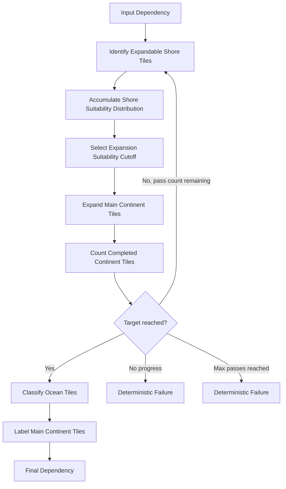
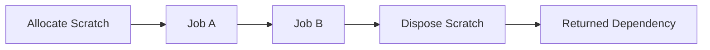

# ADR-006 — Scheduler and Repeated Job Chains

## Status

Accepted.

## Date

2026-05-16

## Context

Atlas operations may require multiple jobs, temporary buffers, deterministic reductions, and repeated sub-chains.

Examples include:

```text
continent area completion
component labeling
distance transforms
erosion passes
hydrology routing
lake solving
validation reductions
````

A job must perform one deterministic transformation over known data. A job must not decide how many times the operation runs, when a loop terminates, or how operation scratch is allocated and disposed.

Atlas needs an explicit scheduler contract for operation-level job graphs, especially when part of the graph repeats.

## Decision

Schedulers own operation job-graph control flow.

A scheduler is responsible for:

```text
job order
dependency chaining
repeated sub-chains
operation scratch allocation
operation scratch disposal
termination policy
failure policy
```

A job is responsible only for one data transformation.

The mandatory boundary is:

```text
Operation
  owns semantic result and invariant

Scheduler
  owns algorithm control flow

Job
  owns one Burst-executable data transform
```

Repeated job chains are allowed only when bounded by explicit scheduler policy.

## Scheduler Role

A scheduler answers:

```text
Which jobs run?
In what order?
Which jobs repeat?
What dependencies connect them?
What scratch buffers are needed?
When is scratch disposed?
When does the operation succeed or fail?
```

A scheduler receives typed request data.

The request must contain the native views, parameters, dimensions, batch counts, and scratch requirements needed to schedule the operation.

Example shape:

```csharp
public readonly struct CompleteContinentAreaJobRequest
{
    public readonly NativeArray<byte> PrimaryMask;
    public readonly NativeArray<int> SuitabilityQ16;
    public readonly NativeArray<int> Area;

    public readonly NativeArray<byte> LandMask;
    public readonly NativeArray<byte> OceanMask;
    public readonly NativeArray<int> LandLabel;

    public readonly int Width;
    public readonly int Height;
    public readonly int TargetLandCellCount;
    public readonly int MaxExpansionPassCount;
    public readonly int ScoreBinCount;
    public readonly int InnerloopBatchCount;
}
```

The exact request type is operation-specific. Atlas must not introduce a generic scheduler contract that hides the required data.

## Job Role

A job answers:

```text
Given these native inputs and outputs, what one transformation is performed?
```

A job may:

```text
read native containers
write native containers
process cells, blocks, ranges, components, or links
perform deterministic fixed-point math
perform one reduction pass
```

A job must not:

```text
resolve StableDataId
resolve compiled bindings
inspect operation catalogs
inspect stage schemas
decide repeat count
allocate operation-level scratch
dispose operation-level scratch
capture artifacts
perform file IO
use UnityEngine objects
```

## Repeated Chain Policy

A repeated chain is a scheduler-owned subgraph.

A repeated chain must define:

```text
maximum pass count
termination condition
no-progress policy
failure behavior
dependency chain
scratch lifetime
```

A repeated chain must not be unbounded.

Valid terminal states include:

```text
target reached
no progress possible
maximum pass count reached
invalid configuration detected
```

The operation contract decides whether a non-target terminal state is a deterministic failure, a warning, or an accepted fallback.

Production canonical generation must not contain hidden “run until stable” loops.

## Example: CompleteContinentArea

`CompleteContinentArea` needs to expand a preserved primary continent until the requested land area is reached.

The operation owns the invariant:

```text
publish final land/ocean/label fields for a completed primary continent
```

The scheduler owns the repeated expansion chain:

```text
IdentifyExpandableShoreTilesJob
AccumulateShoreSuitabilityDistributionJob
SelectExpansionSuitabilityCutoffJob
ExpandMainContinentTilesJob
CountCompletedContinentTilesJob
```

After the expansion terminal state is reached, the scheduler schedules publishing jobs:

```text
ClassifyOceanTilesJob
LabelMainContinentTilesJob
```



No job in this graph decides how many times the expansion sub-chain runs.

## Dependency Policy

Schedulers must chain dependencies explicitly.

If job B reads data written by job A, job B must depend on job A.

If scratch is read or written by jobs, scratch disposal must depend on the final job that can access it.

Required invariant:

```text
Returned scheduler dependency includes all scheduled jobs and all scheduled scratch disposal.
```

## Scratch Policy

Operation scratch is scheduler-owned or scheduler-requested.

Scratch memory must live until the last job that reads or writes it has completed.

Scratch disposal must be dependency-aware.

Valid pattern:

```text
allocate scratch
schedule jobs that use scratch
schedule scratch disposal after final scratch user
return disposal dependency
```



Invalid pattern:

```text
allocate scratch
schedule jobs
dispose scratch immediately
return job dependency
```

## Sync Point Policy

Schedulers should avoid sync points by default.

A scheduler may complete dependencies only when the operation contract explicitly permits a controlled sync point.

Reasons a scheduler might require a sync point:

```text
host must read a scalar result to decide next pass
operation uses bounded CPU-side control flow
diagnostic or failure decision cannot be represented as scheduled data
```

Sync points must be documented because they affect performance and scheduling.

For large maps, scheduler design should prefer:

```text
deterministic histograms
prefix sums
fixed maximum pass scheduling
stable per-block reductions
single-pass quota selection when possible
```

over repeated host-controlled completion.

## Failure Policy

Schedulers must fail deterministically when the job graph cannot satisfy the operation contract.

Examples:

```text
invalid dimensions
invalid batch count
output length mismatch
unsupported route
required scratch allocation size invalid
target area impossible
no progress possible
maximum pass count reached
```

Failure must identify the operation/scheduler boundary.

A scheduler must not silently skip jobs.

A scheduler must not publish partial canonical output as success unless the operation contract explicitly allows it.

## Request Validation

Schedulers must validate request data before scheduling jobs.

Validation should include:

```text
native container created
native container lengths match expected dimensions
width and height are positive
batch count is positive
parameter ranges are valid
scratch sizes are valid
route is supported
```

Validation must happen before any jobs are scheduled when possible.

## Naming Policy

Scheduler request types use `JobRequest`.

Good:

```text
CompleteContinentAreaJobRequest
ComposeBaseElevationJobRequest
PreserveMainContinentJobRequest
```

Avoid:

```text
Schedule
Context
Data
Info
```

Scheduler types use `JobScheduler`.

Good:

```text
CompleteContinentAreaJobScheduler
ComposeBaseElevationJobScheduler
PreserveMainContinentJobScheduler
```

Job names describe one transformation.

Good:

```text
IdentifyExpandableShoreTilesJob
ExpandMainContinentTilesJob
ClampBaseElevationJob
```

Bad:

```text
CompleteContinentAreaJob
LandmassJob
GenerateJob
```

## Interface Policy

Atlas will not introduce a broad untyped `IJobScheduler`.

A useful scheduler contract requires typed request data. A generic interface may be introduced later only if it preserves operation-specific request types and has real reuse.

Rejected shape:

```csharp
public interface IJobScheduler
{
    JobHandle Schedule(JobHandle dependency);
}
```

This hides the actual scheduling contract and is not useful.

Acceptable future shape if proven valuable:

```csharp
public interface IAtlasJobScheduler<TRequest>
    where TRequest : struct
{
    JobHandle Schedule(
        in TRequest request,
        JobHandle dependency);
}
```

This ADR does not require that interface now.

## Testing Requirements

Scheduler tests must verify:

```text
valid request schedules expected job chain
invalid dimensions rejected
invalid lengths rejected
invalid batch count rejected
unsupported route rejected
dependencies are respected
scratch disposal is chained
repeated chains terminate
max pass count is enforced
no-progress behavior is deterministic
```

Job tests must verify:

```text
one transformation only
expected output for small fixtures
deterministic behavior
edge cases
range rules
```

Operation tests must verify:

```text
compiled bindings are resolved correctly
scheduler request is constructed correctly
missing bindings fail
wrong storage format fails
operation returns final dependency
```

## Consequences

### Positive

This keeps jobs simple and Burst-friendly.

It makes repeated algorithms explicit and testable.

It prevents unbounded hidden loops.

It gives scratch memory a safe ownership boundary.

It allows operations to evolve from one job to complex job graphs without changing operation identity.

### Negative

Schedulers become important production code and require tests.

Repeated chains may need careful design to avoid sync-point-heavy execution.

Some algorithms require additional scratch/request structures.

A simple operation may still need a scheduler type to preserve the boundary.

## Rejected Alternatives

### Rejected: Job decides repetition

This hides operation control flow inside a job and makes termination/failure policy unclear.

### Rejected: Operation directly schedules every job

This mixes binding validation, parameter handling, control flow, and job scheduling in one class.

### Rejected: Unbounded run-until-stable loops

This creates unpredictable runtime and unclear failure behavior.

### Rejected: Untyped scheduler abstraction

An untyped scheduler interface hides the native data contract and does not improve production quality.

## Invariants

Atlas implementation must preserve these invariants:

```text
Schedulers own job ordering.
Schedulers own repeated sub-chains.
Schedulers own scratch lifetime.
Schedulers return a dependency that includes scratch disposal.
Jobs perform one deterministic transformation.
Jobs do not decide repeat counts.
Repeated chains are bounded.
No-progress behavior is deterministic.
Schedulers validate request data before scheduling when possible.
Operations own semantic success/failure invariants.
```

```