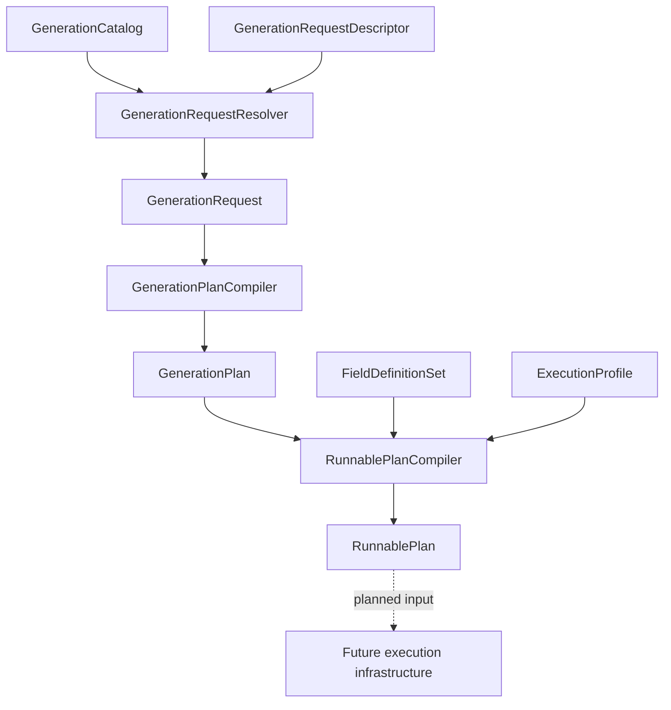

# Managed generation pipeline

The managed generation pipeline converts symbolic caller intent into deterministic managed runnable metadata without allocating native storage or executing work.



## Catalog construction

`GenerationCatalogBuilder` accepts explicit semantic inventory and builds a `GenerationCatalog`.

The catalog validates semantic graph ownership and consistency across:

```text
schemas
resources
stages
routes
route steps
operations
operation implementations
recipes
```

Catalog ownership is reference-exact. Symbol-equivalent instances are not treated as owned.

`GenerationCatalog` does not own field metadata or execution-profile metadata.

## Request resolution

`GenerationRequestDescriptor` is symbolic caller intent.

`GenerationRequestResolver` resolves descriptor symbols against a `GenerationCatalog` and returns a `GenerationRequestResolutionResult`.

Resolution failures are expected caller-input failures and are represented as structured errors, not exceptions.

`GenerationRequest` is accepted resolved generation intent. It contains resolved references and selected implementation choices.

## Semantic plan compilation

`GenerationPlanCompiler` converts a `GenerationRequest` into a `GenerationPlan`.

`GenerationPlan` contains deterministic semantic plan order:

```text
StagePlanNode rows
OperationPlanNode rows nested under stage plan nodes
accepted recipe and request references
accepted run settings
```

A `GenerationPlan` does not contain field handles, workspace allocations, scheduler dependencies, native containers, jobs, ECS data, artifacts, or diagnostics.

## Runnable plan compilation

`RunnablePlanCompiler` converts semantic plan metadata into managed runnable metadata.

Inputs:

```text
GenerationPlan
FieldDefinitionSet
ExecutionProfile
```

Output:

```text
RunnablePlanCompilationResult
```

A successful result contains a `RunnablePlan` and no errors.

A failed result contains deterministic structured errors and no partial runnable plan.

Runnable compilation assigns dense plan-local indices:

```text
FieldIndex
StageIndex
OperationIndex
```

It also builds immutable table rows:

```text
ResourceFieldBinding
RunnableStage
RunnableOperation
RunnablePlan
```

## Current pipeline endpoint

The current implemented pipeline endpoint is `RunnablePlan`.

`RunnablePlan` is not execution. It is managed executable metadata for later workspace and scheduler infrastructure.

## Future execution boundary

Future execution infrastructure consumes `RunnablePlan` after it exists.

Future infrastructure owns:

```text
GenerationWorkspace
FieldHandle
WorkspaceAllocation
OperationScheduler
OperationScratch
NativeArray<T> and other native containers
JobHandle dependencies
Burst-compatible jobs
Artifact capture execution
Runtime diagnostic capture
ECS execution integration
```

These concepts must not leak into current semantic planning or runnable metadata objects.
