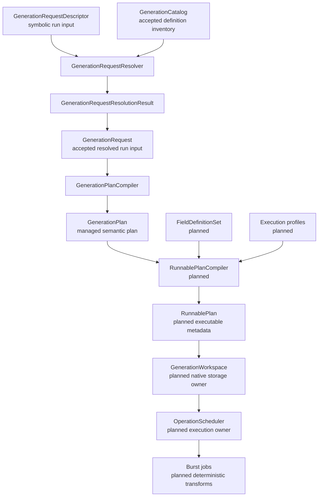

# Lokrain.Atlas architecture documentation

This directory contains the architecture documentation for Lokrain.Atlas.

The documentation defines the package model, ownership boundaries, naming rules, dependency rules, error-handling rules, planned execution boundaries, and implementation order.

The current Runtime architecture is managed architecture. It ends at `GenerationPlan`.

Future execution architecture is documented separately and must not be treated as implemented Runtime behavior until corresponding Runtime code exists.

## Current Runtime scope

The current Runtime architecture includes:

- core value objects;
- generation schemas;
- semantic resource definitions;
- stage kinds and operation kinds;
- stage definitions, stage routes, and stage route steps;
- operation definitions and operation implementation definitions;
- stage and operation contracts;
- generation recipes;
- immutable generation catalogs;
- generation run settings;
- symbolic generation request descriptors;
- operation implementation override descriptors;
- request resolution into accepted generation requests;
- request resolution results and errors;
- managed generation plan compilation;
- managed generation plans.

The current Runtime architecture does not allocate native storage, compile runnable execution metadata, create field handles, schedule jobs, execute Burst jobs, produce artifacts, or integrate with ECS execution.

## Planned execution scope

The following concepts are planned architecture:

- `FieldDefinition`;
- `FieldDefinitionSet`;
- execution profiles;
- runnable plan compilation;
- `RunnablePlan`;
- runnable stages and runnable operations;
- field bindings;
- field handles;
- `GenerationWorkspace`;
- native storage allocation;
- scratch memory ownership;
- operation scheduling;
- dependency wiring;
- Burst job execution;
- unsafe memory infrastructure;
- generated artifacts;
- execution diagnostics;
- ECS execution integration.

Future concepts must be documented as planned architecture. They must not be described as current Runtime behavior unless the corresponding Runtime code exists.

## Architecture map

## Documentation structure

### Overview

| File | Purpose |
| --- | --- |
| `Overview/Atlas Architecture Overview.md` | Introduces the package architecture, major layers, and current/planned boundary. |
| `Overview/Managed Generation Pipeline.md` | Explains descriptor resolution, accepted requests, and managed plan compilation. |

### Concepts

| File | Purpose |
| --- | --- |
| `Concepts/Accepted Domain Object Model.md` | Defines accepted objects, descriptors, result objects, validation boundaries, and construction rules. |
| `Concepts/Catalog Recipe Request and Plan Model.md` | Explains how catalog inventory, recipes, request descriptors, accepted requests, and plans relate. |
| `Concepts/Resource Field and Workspace Boundary.md` | Defines the boundary between semantic resources, planned field definitions, and planned native workspace storage. |

### Guidelines

| File | Purpose |
| --- | --- |
| `Guidelines/Architecture Rules.md` | Defines validity, ownership, layering, and boundary rules. |
| `Guidelines/Naming Guidelines.md` | Defines naming rules for public API, domain concepts, symbols, resources, and generation definitions. |
| `Guidelines/Dependency Rules.md` | Defines allowed dependency direction between package layers. |
| `Guidelines/Error Handling Rules.md` | Defines when APIs throw and when they return result objects. |

### Reference

| File | Purpose |
| --- | --- |
| `Reference/Glossary.md` | Defines architecture terminology without design rationale or implementation plans. |

### Future

| File | Purpose |
| --- | --- |
| `Future/Field Definition and Execution Profiles.md` | Defines the planned storage-facing field model and execution profile boundary. |
| `Future/Runnable Plan Compilation.md` | Defines the planned compiler from managed plans to executable metadata. |
| `Future/Scheduler Workspace and Job Ownership.md` | Defines planned ownership of native storage, scheduling, scratch memory, dependencies, and jobs. |
| `Future/Low-Level Native Memory and Unsafe Collections.md` | Defines planned policy for native containers, unsafe collections, low-level memory APIs, canonical data, and data structure selection. |

### Decisions

| File | Purpose |
| --- | --- |
| `Decisions/ResourceDefinition Before FieldDefinition.md` | Records why semantic resources are modeled before storage-facing field definitions. |

### Plans

| File | Purpose |
| --- | --- |
| `Plans/Implementation Plan.md` | Defines ordered implementation work. |

## Documentation ownership

Overview documents explain the architecture.

Concept documents teach the model.

Guideline documents define rules.

Reference documents define terms.

Future documents describe planned architecture that is not implemented.

Decision documents record accepted rationale, rejected options, and deferrals.

Plan documents define ordered work.

## Documentation rules

Architecture documents describe the required design in present tense.

Current architecture documents must not describe completed migration work, obsolete names, or previous designs as part of the active model.

Planned concepts must be explicitly marked as planned architecture.

The glossary defines terms only. It does not argue for design choices, duplicate guideline rules, or contain implementation steps.

Naming guidelines stay focused on names. Ownership, validity, dependency, and error-handling rules belong in their dedicated guideline documents.

Implementation plans do not redefine architecture. They reference architecture documents and describe concrete work order.

## Primary Runtime invariants

Accepted domain objects are valid after construction.

Descriptors are symbolic input. They are not accepted requests.

Result objects represent expected boundary failures.

Catalogs own accepted definition objects and validate exact ownership.

Catalog ownership is reference-exact. Symbol equality does not make a definition catalog-owned.

Recipes describe generation templates. They do not represent one generation run.

Requests describe one accepted resolved generation run. They contain accepted definitions and final implementation choices.

Requests contain no unresolved symbols.

Plans are managed semantic data.

Plans contain no native execution state, field handles, job handles, dependency handles, scheduler bindings, or executable job data.

`ResourceDefinition` describes the semantic identity of a generated value.

Stage and operation contracts define semantic resource flow.

Contracts use `ResourceDefinition` inputs and outputs.

Contracts do not define storage.

`FieldDefinition` is planned storage-facing metadata.

Native containers belong to planned workspace execution, not catalogs, recipes, requests, plans, stages, operations, or resources.

Schedulers own planned execution control flow, dependency wiring, scratch allocation, and job scheduling.

Jobs receive native containers and unmanaged values only.

Jobs must not depend on symbols, catalogs, recipes, requests, plans, resources, field definitions, workspaces, or schedulers.