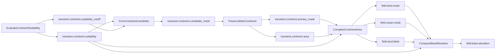

# Landmass Field and Operation Contract Table

## Document Type

Design Specification.

## Status

Draft.

## Purpose

This document defines the field and operation contracts for the `Landmass` stage `PrimaryContinent` route. It translates the architecture into field contracts, operation access contracts, lifetimes, storage expectations, and producer/consumer relationships.

## Stage Contract

```text
Stage: Landmass
Route: PrimaryContinent
```

Operations:

```text
01. EvaluateContinentSuitability
02. FormContinentCandidate
03. PreserveMainContinent
04. CompleteContinentArea
05. ComposeBaseElevation
```

## Shape Domain

The primary map field shape is `MapCells`, meaning one element per generated map cell and length `width * height`. Scalar stage-transient fields use `Scalar`.

## Field Format Conventions

Mask fields use byte where `0 = false` and `1 = true`. Label fields use int unless an accepted decision changes them to ushort. Suitability and elevation fields use Int32 Q16.16. Count fields use int scalar.

## Canonical Field Contracts

### `field.land.mask`

| Property | Value |
|---|---|
| Lifetime | Canonical |
| Shape domain | MapCells |
| Storage | NativeArray<byte> |
| Producer | CompleteContinentArea |
| Artifact default | Included |

Invariant: `field.land.mask[cell] == 1` iff the cell belongs to completed primary continent land.

### `field.ocean.mask`

| Property | Value |
|---|---|
| Lifetime | Canonical |
| Shape domain | MapCells |
| Storage | NativeArray<byte> |
| Producer | CompleteContinentArea |
| Artifact default | Included |

Invariant: `field.ocean.mask[cell] == 1` iff `field.land.mask[cell] == 0` for this route.

### `field.land.label`

| Property | Value |
|---|---|
| Lifetime | Canonical |
| Shape domain | MapCells |
| Storage | NativeArray<int> |
| Producer | CompleteContinentArea |
| Artifact default | Included |

Initial semantics: `0 = non-land`, `1 = primary continent`.

### `field.base.elevation`

| Property | Value |
|---|---|
| Lifetime | Canonical |
| Shape domain | MapCells |
| Storage | NativeArray<int> |
| Format | Q16.16 fixed-point |
| Producer | ComposeBaseElevation |
| Artifact default | Included |

Invariant: every map cell has deterministic base elevation inside configured range.

## Stage-Transient Field Contracts

Required stage-transient fields:

```text
transient.continent.suitability          NativeArray<int> Q16.16 MapCells
transient.continent.suitability_cutoff   scalar int Q16.16
transient.continent.candidate_mask       NativeArray<byte> MapCells
transient.continent.primary_mask         NativeArray<byte> MapCells
transient.continent.area                 scalar int
transient.continent.growth_cutoff        scalar int Q16.16
```

All are excluded from default artifact capture and default canonical hashes.

## Operation Access Contracts

### EvaluateContinentSuitability

Writes:

```text
transient.continent.suitability          FullCapacity
transient.continent.suitability_cutoff   FullCapacity
```

Write policy: `DiscardBeforeWrite`, `RequiresExclusiveWrite`.

### FormContinentCandidate

Reads:

```text
transient.continent.suitability
transient.continent.suitability_cutoff
```

Writes:

```text
transient.continent.candidate_mask       FullCapacity
```

Write policy: `DiscardBeforeWrite`, `RequiresExclusiveWrite`.

### PreserveMainContinent

Reads:

```text
transient.continent.candidate_mask
```

Writes:

```text
transient.continent.primary_mask         FullCapacity
transient.continent.area                 FullCapacity
```

Write policy: `DiscardBeforeWrite`, `RequiresExclusiveWrite`.

### CompleteContinentArea

Reads:

```text
transient.continent.suitability
```

Reads/writes:

```text
transient.continent.primary_mask         FullLogicalLength
transient.continent.area                 FullCapacity
```

Writes:

```text
transient.continent.growth_cutoff        FullCapacity
field.land.mask                          FullCapacity
field.ocean.mask                         FullCapacity
field.land.label                         FullCapacity
```

Output write policy: `DiscardBeforeWrite`, `RequiresExclusiveWrite`.

Mutation write policy for `primary_mask` and `area`: `PreserveExistingContent`, `RequiresExclusiveWrite`.

### ComposeBaseElevation

Reads:

```text
field.land.mask
field.ocean.mask
field.land.label
transient.continent.suitability
```

Writes:

```text
field.base.elevation                     FullCapacity
```

Write policy: `DiscardBeforeWrite`, `RequiresExclusiveWrite`.

## Producer and Consumer Graph



## Validation Requirements

The compiler must enforce field presence, correct format, correct shape domain, producer-before-consumer dataflow, write coverage, exclusive writes, stage-transient artifact exclusion, and unsupported storage rejection.

## Implementation Order

1. Add field lifetime/category support if missing.
2. Add canonical Landmass field contracts.
3. Add stage-transient Landmass field contracts.
4. Add operation definitions for the five route operations.
5. Add route/schema validation.
6. Implement operations in route order.
7. Add full Landmass workflow integration test.

## Non-Negotiable Invariants

```text
Canonical outputs are not implementation scratch.
Stage-transient fields are not captured by default.
Operation scratch is never cataloged as a field.
CompleteContinentArea publishes canonical masks only after topology completion succeeds.
ComposeBaseElevation runs after topology outputs exist.
BaseElevation is full-map, not land-only.
Landmass route output is deterministic for the same input contract.
```
