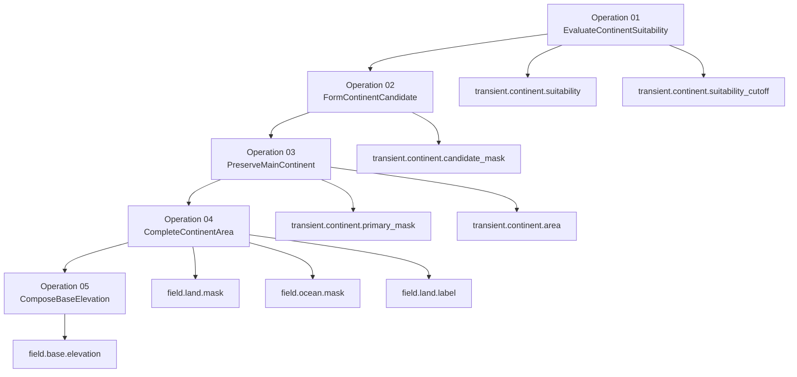
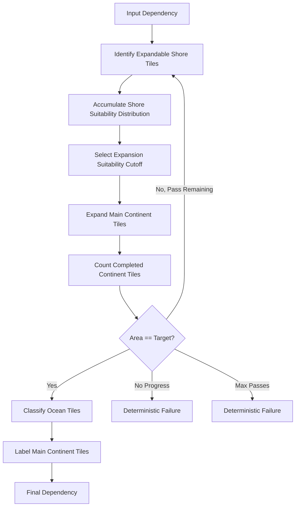

# Landmass Primary Continent Route Specification

## Document Type

Design Specification.

## Status

Draft.

## Package

```text
com.lokrain.atlas
````

## Namespace Root

```text
Lokrain.Atlas
```

## Related ADRs

```text
ADR-001 — Stage, Operation, Route, Scheduler, and Job
ADR-002 — Field Lifetime, Workspace, Transient, Scratch, and Artifact Policy
ADR-003 — Determinism, Fixed-Point, Seed, and Noise Contract
ADR-004 — Catalog, Schema, and Runnable Plan Contract
ADR-005 — Landmass Stage Contract
ADR-006 — Scheduler and Repeated Job Chains
```

## Purpose

This specification defines the `PrimaryContinent` route for the `Landmass` stage.

The route constructs the initial macro landmass topology for a generated map, publishes canonical land/ocean/label fields, and composes the first full-map base elevation field.

The route is topology-first.

```text
continent suitability
-> continent candidate
-> preserved main continent
-> completed target-area continent
-> land/ocean/label masks
-> topology-constrained base elevation
```

The route must not treat raw noise elevation as the first land/ocean authority.

## Scope

This specification covers:

```text
Landmass stage PrimaryContinent route
operation sequence
stage-transient fields
operation scratch buffers
operation responsibilities
job graph shape
scheduler responsibilities
determinism requirements
failure policy
test expectations
```

This specification does not cover:

```text
orography
erosion
hydrology
climate
biomes
surface classification
presentation meshes
physics payloads
navigation payloads
editor preview tooling
```

## High-Level Route Graph



## Stage

```text
Stage: Landmass
```

## Route

```text
Route: PrimaryContinent
```

## Route Responsibility

The `PrimaryContinent` route must produce one coherent primary landmass and the first full-map base elevation.

The route must guarantee:

```text
deterministic land/ocean topology
one primary connected continent
target land area when feasible
canonical land mask
canonical ocean mask
canonical initial land label
canonical full-map base elevation
```

## Canonical Outputs

### `field.land.mask`

Binary land mask.

Expected format:

```text
byte per cell
0 = non-land
1 = land
```

### `field.ocean.mask`

Binary ocean mask.

Expected format:

```text
byte per cell
0 = non-ocean
1 = ocean
```

For this route:

```text
field.ocean.mask[cell] == 1 iff field.land.mask[cell] == 0
```

Later water/lake systems may refine water semantics, but this route publishes initial ocean as the complement of land.

### `field.land.label`

Initial land label.

Expected format:

```text
int or ushort per cell
0 = non-land
1 = primary continent
```

The first route uses a single primary continent label. Multi-continent and island-region labeling belong to later systems or future routes.

### `field.base.elevation`

Initial full-map base elevation.

Expected format:

```text
Int32 Q16.16 fixed-point per cell
```

The field is defined for land and ocean cells.

## Stage-Transient Fields

Stage-transient fields are workspace fields shared between operations inside the `Landmass` stage. They are not canonical artifact output by default.

Required stage-transient fields:

```text
transient.continent.suitability
transient.continent.suitability_cutoff
transient.continent.candidate_mask
transient.continent.primary_mask
transient.continent.area
transient.continent.growth_cutoff
```

### `transient.continent.suitability`

A deterministic per-cell scalar score.

Expected format:

```text
Int32 Q16.16
```

Meaning:

```text
higher value = stronger suitability for primary continent membership
```

Hard-excluded ocean cells must use an explicit sentinel or validity mask. Prefer a fixed sentinel such as `Int32.MinValue` over floating-point negative infinity.

### `transient.continent.suitability_cutoff`

The selected candidate cutoff.

Expected format:

```text
Int32 Q16.16 scalar
```

### `transient.continent.candidate_mask`

Initial thresholded candidate continent mask.

Expected format:

```text
byte per cell
0 = not candidate
1 = candidate
```

### `transient.continent.primary_mask`

Preserved largest connected candidate component.

Expected format:

```text
byte per cell
0 = not primary continent
1 = primary continent
```

### `transient.continent.area`

Current primary-continent area.

Expected format:

```text
int scalar
```

Meaning:

```text
number of cells currently in transient.continent.primary_mask
```

### `transient.continent.growth_cutoff`

Current expansion cutoff used by `CompleteContinentArea`.

Expected format:

```text
Int32 Q16.16 scalar
```

## Operation Scratch Buffers

Operation scratch is private to one operation scheduler and must not be declared as canonical or stage-transient field data.

Expected scratch categories:

```text
suitability_histogram_by_block
suitability_histogram_total
block_component_id
block_component_area
block_component_count
block_component_global_base
border_component_link_a
border_component_link_b
border_component_link_count
component_parent
component_area
primary_component_id
land_count_by_block
expandable_shore_flags
expandable_shore_score
expandable_shore_histogram_by_block
expandable_shore_histogram_total
```

Scratch disposal must be chained through the scheduler’s returned `JobHandle`.

## Parameters

The route requires a parameter object.

Recommended name:

```text
PrimaryContinentParameters
```

Recommended fields:

```text
TargetLandCellCount
GrowthReserveCellCount
HardOceanBorderWidth
FalloffCenterXQ16
FalloffCenterYQ16
FalloffRadiusXQ16
FalloffRadiusYQ16
FalloffExponentQ16
FalloffWeightQ16
NoiseWeightQ16
NoiseFrequencyQ16
NoiseLacunarityQ16
NoisePersistenceQ16
OctaveCount
WarpFrequencyQ16
WarpAmplitudeInCellsQ16
SuitabilityBinCount
ExpansionBinCount
BlockSize
MaxExpansionPassCount
MinBaseElevationQ16
MaxBaseElevationQ16
OceanFloorElevationQ16
LowlandElevationQ16
InteriorElevationBoostQ16
BaseElevationNoiseAmplitudeQ16
BaseElevationNoiseFrequencyQ16
BaseElevationOctaveCount
```

Parameter validation must reject:

```text
non-positive dimensions
target land area <= 0
target land area greater than available non-hard-ocean area
growth reserve < 0
hard ocean border that excludes the full map
bin count <= 1
block size <= 0
octave count <= 0
invalid fixed-point weights
min elevation > max elevation
max expansion pass count <= 0
```

## Operation 01 — EvaluateContinentSuitability

### Responsibility

Score every cell by primary-continent suitability and select a conservative suitability cutoff.

### Inputs

```text
dimensions
root/request seed
PrimaryContinentParameters
```

### Outputs

```text
transient.continent.suitability
transient.continent.suitability_cutoff
```

### Scheduler

```text
EvaluateContinentSuitabilityJobScheduler
```

### Jobs

```text
EvaluateTileContinentSuitabilityJob
AccumulateSuitabilityDistributionJob
SelectCandidateSuitabilityCutoffJob
```

### Job 01 — EvaluateTileContinentSuitabilityJob

Computes a deterministic suitability score per cell.

Required behavior:

```text
convert index to x/y
apply hard-ocean boundary exclusion
sample deterministic domain warp
compute continent-centered falloff
compute deterministic fBm detail
combine falloff and noise
write suitability
```

Implementation must use deterministic fixed-point or approved deterministic math.

Hard-excluded cells must receive an explicit excluded value.

The job must not use floating-point negative infinity.

Recommended excluded value:

```text
PrimaryContinentConstants.ExcludedSuitabilityQ16 = int.MinValue
```

### Job 02 — AccumulateSuitabilityDistributionJob

Builds per-block suitability histograms.

Required behavior:

```text
iterate cells in one block
ignore excluded suitability
normalize or remap suitability to histogram range
quantize to bin
increment block-local histogram
```

Histogram accumulation must be deterministic.

### Job 03 — SelectCandidateSuitabilityCutoffJob

Merges per-block histograms and selects the candidate cutoff.

Required behavior:

```text
merge histograms in stable block order
walk bins from highest suitability to lowest
accumulate candidate cell count
stop at conservative candidate target
write transient.continent.suitability_cutoff
```

Candidate target:

```text
CandidateCellCount = TargetLandCellCount - GrowthReserveCellCount
```

If the computed candidate target is invalid, the scheduler must fail deterministically before scheduling or the job must produce a deterministic failure signal consumed by the scheduler.

### Invariants

```text
Every non-excluded cell has deterministic suitability.
Excluded cells cannot become candidates.
Cutoff selection is deterministic.
Candidate target is conservative.
```

## Operation 02 — FormContinentCandidate

### Responsibility

Convert suitability into an initial continent candidate mask.

### Inputs

```text
transient.continent.suitability
transient.continent.suitability_cutoff
```

### Outputs

```text
transient.continent.candidate_mask
```

### Scheduler

```text
FormContinentCandidateJobScheduler
```

### Jobs

```text
MarkCandidateContinentTilesJob
```

### Job 01 — MarkCandidateContinentTilesJob

Required behavior:

```text
read suitability
read cutoff
if suitability is excluded -> candidate = 0
else if suitability >= cutoff -> candidate = 1
else candidate = 0
```

### Invariants

```text
Candidate mask is deterministic.
Candidate mask does not guarantee connectedness.
Excluded cells are never candidates.
```

## Operation 03 — PreserveMainContinent

### Responsibility

Preserve only the deterministic main connected component from the candidate mask.

### Inputs

```text
transient.continent.candidate_mask
```

### Outputs

```text
transient.continent.primary_mask
transient.continent.area
```

### Scheduler

```text
PreserveMainContinentJobScheduler
```

### Jobs

```text
LabelCandidateLandWithinBlocksJob
AssignComponentGlobalRangesJob
LinkComponentsAcrossBlockBordersJob
MergeLinkedLandComponentsJob
MeasureConnectedLandComponentsJob
ChooseMainContinentJob
PreserveMainContinentTilesJob
CountMainContinentTilesJob
```

### Job 01 — LabelCandidateLandWithinBlocksJob

Labels connected candidate cells inside each block.

Connectivity:

```text
4-neighbour adjacency
```

Required behavior:

```text
run per block
scan block cells in deterministic row-major order
start local flood fill for unlabeled candidate cells
assign block-local component ids
store block-local component area
store block component count
```

Block-local flood-fill queues are operation scratch.

### Job 02 — AssignComponentGlobalRangesJob

Assigns global component id ranges for each block.

Required behavior:

```text
iterate blocks in deterministic block order
assign global base id per block
initialize component_parent[id] = id
initialize component area from block-local area
```

### Job 03 — LinkComponentsAcrossBlockBordersJob

Emits component links across block boundaries.

Required behavior:

```text
compare right edge to neighbour left edge
compare top edge to neighbour bottom edge
emit links only when both touching cells are candidate land
avoid duplicate left/down comparisons
```

Link buffers are operation scratch.

### Job 04 — MergeLinkedLandComponentsJob

Merges linked components.

Required behavior:

```text
iterate emitted links in deterministic order
find root for each side
union roots deterministically
compress paths if required
```

Tie-break:

```text
smaller stable component id wins
```

unless a later accepted design chooses rank/area with stable tie-break.

### Job 05 — MeasureConnectedLandComponentsJob

Computes resolved component areas.

Required behavior:

```text
clear resolved area buffers
resolve each component root
accumulate component area into root area
merge partial buffers in stable order
```

No nondeterministic atomics for canonical results.

### Job 06 — ChooseMainContinentJob

Selects the main component.

Required behavior:

```text
largest area wins
area tie -> smaller component id wins
write primary_component_id scratch scalar
```

### Job 07 — PreserveMainContinentTilesJob

Writes the primary mask.

Required behavior:

```text
for each candidate cell:
  resolve local component
  convert to global component
  resolve root
  primary_mask = root == primary_component_id
```

Non-candidate cells write `0`.

### Job 08 — CountMainContinentTilesJob

Counts preserved primary-continent cells.

Required behavior:

```text
count primary_mask == 1 per block
reduce block counts in stable order
write transient.continent.area
```

### Invariants

```text
Only one connected component remains in primary_mask.
Component selection is deterministic.
Area is the number of cells in primary_mask.
```

## Operation 04 — CompleteContinentArea

### Responsibility

Expand the preserved main continent to the target land area and publish canonical land/ocean/label fields.

### Inputs

```text
transient.continent.primary_mask
transient.continent.suitability
transient.continent.area
```

### Outputs

```text
field.land.mask
field.ocean.mask
field.land.label
```

### Updated Stage-Transient Outputs

```text
transient.continent.area
transient.continent.growth_cutoff
```

### Scheduler

```text
CompleteContinentAreaJobScheduler
```

### Repeated Sub-Chain Jobs

```text
IdentifyExpandableShoreTilesJob
AccumulateShoreSuitabilityDistributionJob
SelectExpansionSuitabilityCutoffJob
ExpandMainContinentTilesJob
CountCompletedContinentTilesJob
```

### Publishing Jobs

```text
ClassifyOceanTilesJob
LabelMainContinentTilesJob
```

### Scheduler Control Flow



The scheduler owns the loop.

Jobs perform one pass only.

### Job 01 — IdentifyExpandableShoreTilesJob

Required behavior:

```text
for each non-primary cell:
  reject excluded suitability
  check 4-neighbours
  mark expandable if any neighbour is primary land
  write expandable shore score from suitability
```

### Job 02 — AccumulateShoreSuitabilityDistributionJob

Required behavior:

```text
clear block-local shore histogram
iterate block cells
if expandable, quantize score
increment block-local bin
```

### Job 03 — SelectExpansionSuitabilityCutoffJob

Required behavior:

```text
missing = TargetLandCellCount - current area
if missing <= 0:
  write terminal cutoff
else:
  merge shore histograms in stable order
  walk bins high to low
  stop when accumulated >= missing
  write growth cutoff
```

### Job 04 — ExpandMainContinentTilesJob

Required behavior:

```text
include expandable tiles with score > cutoff
include enough score == cutoff tiles to hit target
tie-break by deterministic row-major index or equivalent stable order
write selected cells into primary_mask
```

Expansion must preserve connectivity by adding only expandable shore cells adjacent to current primary land.

### Job 05 — CountCompletedContinentTilesJob

Required behavior:

```text
count primary_mask == 1
reduce in stable order
write transient.continent.area
```

The scheduler uses the resulting area to decide whether another pass is required.

### Job 06 — ClassifyOceanTilesJob

Publishes canonical masks.

Required behavior:

```text
field.land.mask[cell] = primary_mask[cell]
field.ocean.mask[cell] = primary_mask[cell] == 1 ? 0 : 1
```

### Job 07 — LabelMainContinentTilesJob

Publishes canonical land labels.

Required behavior:

```text
field.land.label[cell] = field.land.mask[cell] == 1 ? 1 : 0
```

### Invariants

```text
Connectivity is preserved during expansion.
Final land area equals target area when operation succeeds.
Land mask and ocean mask are exact complements.
Land label marks primary-continent land.
```

## Operation 05 — ComposeBaseElevation

### Responsibility

Produce initial full-map base elevation constrained by accepted land/ocean topology.

### Inputs

```text
field.land.mask
field.ocean.mask
field.land.label
transient.continent.suitability
PrimaryContinentElevationParameters
```

### Outputs

```text
field.base.elevation
```

### Scheduler

```text
ComposeBaseElevationJobScheduler
```

### Jobs

Initial route may use:

```text
ComposePrimaryContinentBaseElevationJob
ClampBaseElevationJob
```

Future jobs may include:

```text
OceanShelfProfileJob
CoastTransitionProfileJob
InteriorElevationNoiseJob
BaseElevationRangeValidationJob
```

### ComposePrimaryContinentBaseElevationJob

Required behavior:

```text
read land mask
read ocean mask
read land label
read continent suitability
sample deterministic elevation noise
compose ocean and land elevation profile
write base elevation Q16.16
```

Noise must not change topology.

### ClampBaseElevationJob

Required behavior:

```text
clamp base elevation to configured min/max range
```

### Invariants

```text
Every cell receives base elevation.
Base elevation is fixed-point.
Base elevation respects land/ocean topology.
Base elevation is deterministic.
Base elevation remains inside configured range.
```

## Deterministic Math Requirements

The implementation must use deterministic fixed-point or approved deterministic integer math.

Design equations may be written using familiar mathematical notation, but implementation must not rely on platform-variable floating-point behavior for canonical output.

Required deterministic areas:

```text
noise sampling
domain warp
falloff
histogram binning
cutoff selection
component merging
component area reduction
growth tie-break
base elevation composition
```

## Failure Policy

The route must fail deterministically when required conditions cannot be satisfied.

Failure cases include:

```text
invalid dimensions
invalid target land area
hard ocean boundary excludes too much area
empty candidate mask
no connected candidate component
target area cannot be reached
max expansion pass count reached
no expansion progress possible
unsupported storage
missing field binding
invalid parameter range
```

The failure must identify the operation boundary.

## Artifact Policy

Default artifact output includes:

```text
field.land.mask
field.ocean.mask
field.land.label
field.base.elevation
```

Default artifact output excludes:

```text
transient.continent.*
operation scratch buffers
```

Debug artifact profiles may include stage-transient fields explicitly.

## Testing Matrix

### Suitability Tests

```text
same seed and parameters produce same suitability
different seed changes suitability
hard ocean border excludes cells
cutoff selection is deterministic
candidate target uses growth reserve
```

### Candidate Tests

```text
candidate mask follows cutoff
excluded cells never become candidates
all output cells are written
```

### Component Tests

```text
block-local labels are deterministic
cross-block links merge components
largest component is selected
tie selects lower component id
primary mask contains only selected component
area matches primary mask count
```

### Completion Tests

```text
shore cells are identified by 4-neighbour adjacency
shore histogram is deterministic
growth cutoff is deterministic
tie expansion uses stable row-major order
connectivity is preserved
target area is reached when feasible
no-progress failure is deterministic
max-pass failure is deterministic
land/ocean masks are complements
land labels match land mask
```

### Base Elevation Tests

```text
every cell receives elevation
land and ocean profiles differ as configured
noise does not change topology
values remain in range
same input produces same bytes
```

### Workflow Tests

```text
Landmass PrimaryContinent route compiles
operation sequence executes in order
canonical outputs exist
stage-transient fields are not captured by default
artifact round-trip preserves canonical fields
debug export can visualize selected fields
```

## Implementation Notes

This specification does not require all operations to be implemented in one commit.

Recommended implementation order:

```text
1. Field and operation contract definitions
2. Stage-transient field lifetime support
3. Operation scratch allocator support
4. EvaluateContinentSuitability
5. FormContinentCandidate
6. PreserveMainContinent
7. CompleteContinentArea
8. ComposeBaseElevation
9. Full Landmass workflow integration
```

Each operation must be delivered with:

```text
job tests
scheduler tests
operation executor tests
workflow or integration tests when applicable
```

## Open Design Questions

These require future design decisions before implementation:

```text
Exact fixed-point falloff approximation
Exact deterministic noise implementation for suitability
Exact histogram bin count and quantization
Block size for component labeling
Component union strategy and memory layout
Expansion strategy for very large maps
Whether CompleteContinentArea may use sync points
Exact base elevation profile rules
Whether transient debug capture is supported in first route
```

Open questions must not be resolved implicitly inside jobs.

## Success Criteria

The route is successful when:

```text
canonical land mask exists
canonical ocean mask exists
canonical land label exists
canonical base elevation exists
primary continent is connected
target land area is reached when feasible
outputs are deterministic
stage-transient fields do not pollute artifacts by default
all scheduled scratch is disposed safely
all route invariants are covered by tests
```

```