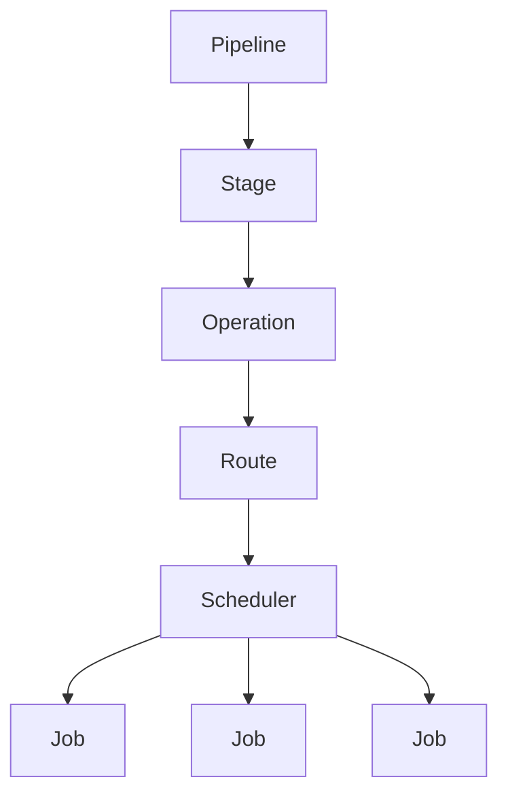
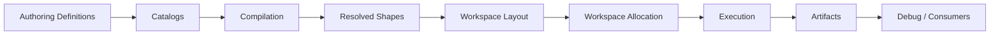

# Lokrain Atlas

## Package

```text
com.lokrain.atlas
````

## Namespace

```text
Lokrain.Atlas
```

## Summary

Lokrain Atlas is a deterministic procedural map-generation package for Unity 6.4.

The package produces canonical world/map data through a compiled, validated, seed-driven execution pipeline. It is designed for Burst, Jobs, Unity Collections, Unity.Mathematics, deterministic simulation, artifact export, and later presentation/runtime consumers.

Atlas is not a rendering package. It does not own terrain meshes, GameObjects, HDRP materials, physics objects, navigation objects, or editor preview UI inside canonical generation. Those systems consume Atlas outputs; they do not define Atlas truth.

## Core Purpose

Atlas exists to generate stable map data.

The package owns:

```text
field definitions
operation definitions
stage and pipeline structure
compilation and validation
workspace allocation
operation execution
job scheduling boundaries
artifact capture
debug data export
deterministic generation algorithms
```

The package does not own:

```text
UnityEngine terrain rendering
GameObject preview scenes
HDRP material authoring
physics runtime objects
navigation runtime objects
editor tooling as canonical runtime truth
```

## Architectural Model

Atlas generation is organized as:

```text
Stage
  semantic generation phase

Operation
  stable deterministic transform with input/output contract

Route
  selected algorithm family used to satisfy a stage or operation contract

Scheduler
  ordered control flow for one operation's job graph

Job
  one Burst-executable data transformation
```

The hierarchy is:



The important boundary is:

```text
Stages decide when work happens.
Operations decide what result is produced.
Routes decide which algorithm family produces it.
Schedulers decide how jobs run.
Jobs perform one deterministic transform.
```

## Canonical Data Flow

Atlas uses explicit data contracts. A generation run moves through these phases:



The canonical runtime path is:

```text
contract catalog
operation catalog
stage schema
pipeline schema
compiled plan
resolved field shapes
workspace layout
workspace memory
operation execution
artifact capture
artifact read/write
debug export
```

## Field Model

Atlas fields are stable data contracts.

A field definition describes:

```text
stable identity
semantic role
storage format
ownership policy
lifetime policy
shape domain
length shape
hash participation
debug name
```

Fields may be:

```text
canonical
payload
diagnostic
stage-transient
external
```

### Canonical Fields

Canonical fields are durable map truth.

Examples:

```text
LandMask
OceanMask
LandLabel
BaseElevation
```

Canonical fields may be consumed by later stages and may be captured into artifacts.

### Payload Fields

Payload fields are derived outputs for downstream systems.

Examples:

```text
presentation payload
physics payload
navigation payload
```

Payload fields are not allowed to redefine canonical world truth.

### Diagnostic Fields

Diagnostic fields support validation, metrics, tooling, and debug output.

Diagnostic fields are explicit. They are not hidden side effects.

### Stage-Transient Fields

Stage-transient fields are produced by one operation and consumed by another operation inside the same stage.

They are allocated by the workspace and participate in compilation, but they are not canonical map truth and are not captured into artifacts by default.

### Operation Scratch

Operation scratch is private temporary native memory used only by jobs inside one operation.

Scratch memory is not a field. It is not addressed by stable field IDs. It is not captured into artifacts. It must be disposed through the correct `JobHandle` dependency chain.

## Execution Model

Atlas execution uses compiled bindings.

Jobs must not resolve fields by stable ID. Jobs receive typed native views, slices, or arrays prepared by operation executors and schedulers.

The execution boundary is:

```text
compiled operation
compiled bindings
workspace views
operation executor
job scheduler
Burst jobs
final JobHandle
```

Operation executors own:

```text
operation-level contract validation
compiled binding resolution
parameter loading
scheduler invocation
final dependency return
```

Schedulers own:

```text
job order
dependency chaining
repeated subchains
operation scratch ownership
scratch disposal
termination policy
```

Jobs own:

```text
one data transform
no managed allocation
no field lookup
no artifact capture
no pipeline inspection
```

## Determinism

Atlas generation must be deterministic under the same:

```text
package version
pipeline schema
field contracts
operation contracts
route selection
seed
parameters
dimensions
```

Canonical generation must avoid platform-dependent behavior.

The default policy is:

```text
fixed-point or integer-first canonical math
stable seed derivation
package-owned deterministic noise
deterministic reduction order
explicit tie-break rules
bounded iteration
```

Floating-point math may be used only when explicitly accepted by architecture and tested against the required determinism target.

## Workspace Ownership

The workspace owns native memory for a run.

Workflow results may complete immediately or carry a scheduled dependency. Native memory and the `JobHandle` protecting it must not be separated accidentally.

A scheduled result is logically:

```text
workspace + final dependency + disposal rule
```

Atlas uses explicit ownership transfer for this reason.

The safe patterns are:

```text
complete execution, then inspect or release workspace
transfer workspace through a lease that also carries the dependency
dispose result or lease to complete dependency before memory disposal
```

## Artifact Model

Artifacts are durable managed exports of completed workspace data.

Artifact capture is separate from artifact data.

Artifact writing is separate from binary serialization.

Artifact reading is separate from file IO.

The artifact layers are:

```text
AtlasArtifact
  immutable artifact data/query object

AtlasArtifactCapture
  completed workspace -> artifact

AtlasArtifactBinaryWriter
  artifact -> stream bytes

AtlasArtifactFileWriter
  artifact -> file

AtlasArtifactBinaryReader
  stream bytes -> artifact

AtlasArtifactFileReader
  file -> artifact
```

Artifacts capture canonical and selected payload/diagnostic data. Stage-transient fields are excluded by default. Operation scratch is never captured.

## Debug Output

Debug output is derived from artifacts or completed workspace data.

Debug requests are data. Exporters perform export work.

Debug output must not become canonical world truth.

## Landmass Direction

The first major generation stage is:

```text
Landmass
```

The `Landmass` stage owns the first macro world shape:

```text
primary land/ocean topology
initial full-map base elevation
```

The accepted direction is topology-first:

```text
shape land/ocean topology
then compose base elevation constrained by topology
```

For the primary-continent route, the intended operation chain is:

```text
EvaluateContinentSuitability
FormContinentCandidate
ExtractMainContinent
CompleteContinentArea
ComposeBaseElevation
```

This keeps landmass topology from becoming an accidental side effect of raw noise thresholding.

## Package Boundaries

Runtime canonical generation must not depend on:

```text
UnityEngine.GameObject
UnityEngine.Mesh
Unity Terrain
HDRP
ECS Graphics
Unity Physics runtime objects
Unity Navigation runtime objects
ScriptableObject authoring as runtime truth
```

Those systems may exist in separate presentation, editor, or integration packages/layers.

## Testing Policy

Atlas tests must protect invariants, not implementation accidents.

Tests should verify:

```text
field and operation contracts
zero-valid identity semantics
compiled binding correctness
dataflow validation
write hazard validation
workspace allocation and disposal
operation execution
scheduler dependency behavior
artifact round-trip behavior
debug export behavior
deterministic generation output
```

Failing tests must be investigated from their actual assertion, exception, or XML export. Tests must not be weakened just to become green.

## Documentation Policy

This package uses:

```text
ADRs
  frozen architectural decisions

Design Specifications
  detailed algorithms, contracts, job graphs, buffers, tests

Implementation Plans
  task order and delivery checkpoints
```

ADRs are authoritative only after acceptance in the restarted documentation set.

Old documents and proposals are research material unless accepted by a new ADR.

## Current Development Priority

The current focus is:

```text
1. Freeze the restarted architecture documentation.
2. Define stage/operation/route/scheduler/job boundaries.
3. Define field lifetime and transient data policy.
4. Define deterministic generation contracts.
5. Define the Landmass stage contract.
6. Implement the first production Landmass route.
```

Atlas should prefer production-grade architecture over temporary shortcuts. Every new operation should have a clear result, a clear contract, a scheduler-owned job graph, and tests that protect the intended invariant.

```